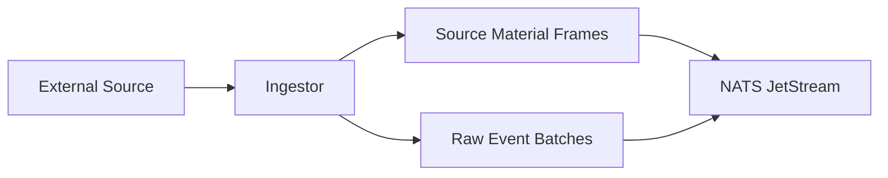
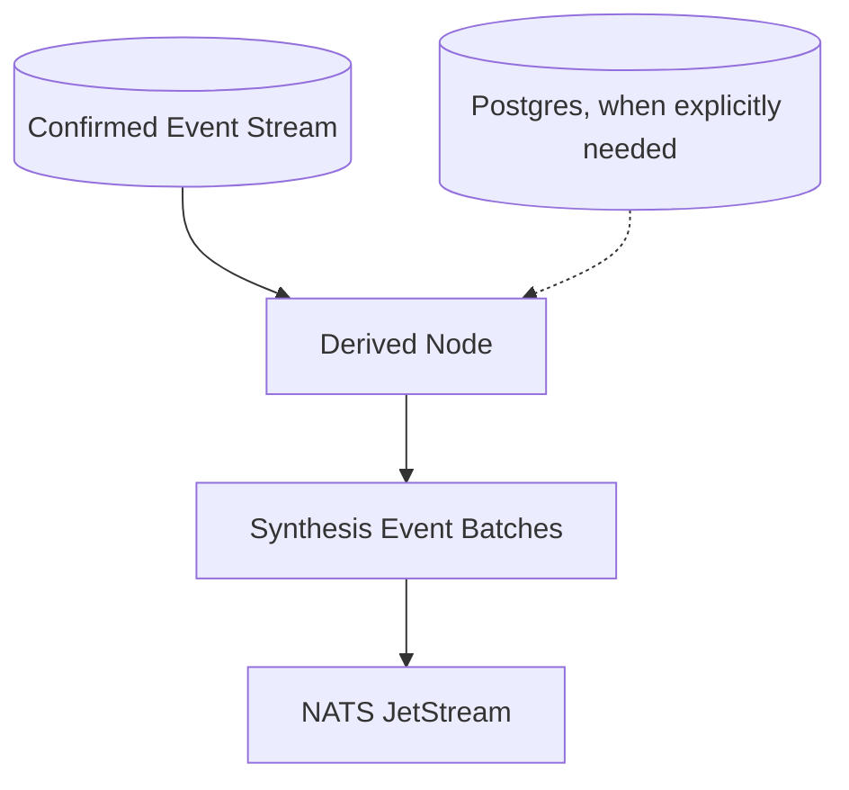

# Node Patterns: Ingestors and Derived Nodes

Sinex node binaries fall into two operational families. They share runtime
plumbing where that reduces duplication, but they do not have the same
responsibility boundary.

## 1. Capture Ingestors

Capture ingestors translate external material into material-provenance events.
They own source acquisition, source-material registration, byte anchoring, and
checkpointing against the external source.

- **Primary trigger**: External inputs such as filesystem notifications,
  append-only files, `SQLite` history rows, sockets, journals, or pollers.
- **Authoring trait**: `IngestorNode`.
- **Adapter**: `IngestorNodeAdapter`.
- **State**: Ingestor-defined checkpoint state persisted through the SDK.
- **Database dependency**: Normal deployed nodes use the runtime configuration
  they need for source-material and preflight surfaces; direct event persistence
  still belongs to `sinex-ingestd`.
- **Examples**:
  - `sinex-fs-ingestor`: watches configured roots and emits filesystem events.
  - `sinex-terminal-ingestor`: captures shell history and live appended rows.
  - `sinex-system-ingestor`: captures journal, device, and login observations.

## 2. Derived Nodes

Derived nodes consume confirmed events and emit synthesis-provenance events.
They derive conclusions from parent event IDs rather than claiming new external
source material.

- **Primary trigger**: Confirmed event streams plus node-local window or scope
  state.
- **Authoring traits**: `TransducerNode`, `WindowedNode`, and
  `ScopeReconcilerNode`.
- **Adapter**: `DerivedNodeAdapter` and the trait-specific adapter aliases.
- **State**: Derived-node state and checkpoints persisted through NATS KV/local
  state as configured by the SDK.
- **Database dependency**: Optional and explicit. Some derived nodes are
  stream-first; others may query canonical storage for reconciliation or
  historical context.
- **Examples**:
  - `sinex-terminal-command-canonicalizer`: maps confirmed shell commands to
    canonical command events.
  - `sinex-analytics-automaton`: emits bounded activity rollups.
  - `sinex-health-automaton`: reconciles component health into aggregate
    reports.
  - `sinex-session-detector`: groups activity windows into session boundaries.

## 3. Deployment Implications

| Feature | Capture Ingestor | Derived Node |
|---------|------------------|--------------|
| **Provenance** | `source_material_id` + byte anchor | non-empty `source_event_ids` |
| **Scale shape** | Source-specific; often one watcher per target surface | Consumer-group, singleton, or partitioned depending on state semantics |
| **Connectivity** | External source access plus NATS/runtime configuration | Confirmed-event stream, optional DB access |
| **Access model** | Minimal source permissions for the target surface | Minimal permissions for event consumption and optional reconciliation |

## 4. Mixed Responsibilities

Avoid combining capture and synthesis in one node unless the source itself
requires that shape. If a node observes external bytes and also derives
cross-event conclusions, split it into an ingestor plus a derived node so the
provenance boundary remains obvious.
