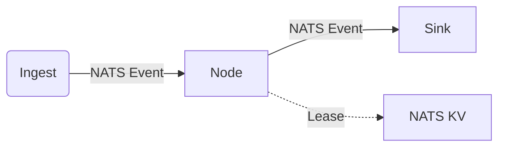
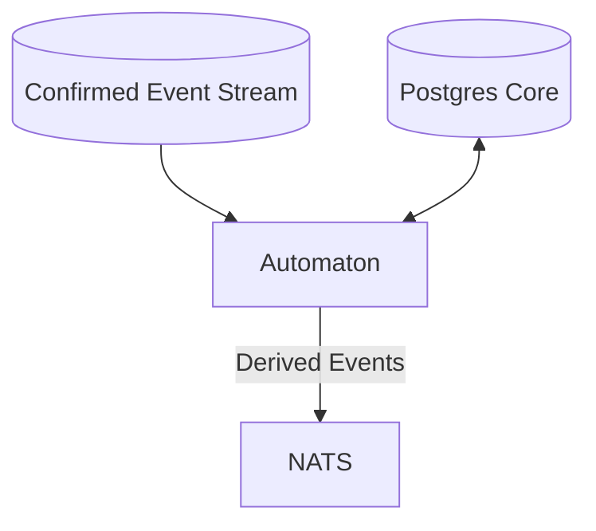

# node Patterns: Nodes vs. Automatons

The Sinex architecture employs two primary patterns for distributed agents ("nodes"). Understanding the distinction is crucial for deployment planning and development.

## 1. Stream Nodes (The "Edge" Model)

Stream Nodes are reactive components designed to operate close to the capture
surface or confirmed event stream.

- **Primary Trigger**: External inputs or inbound confirmed NATS events.
- **State**: Ephemeral or locally cached (via NATS KV).
- **Database Dependency**: **Optional / None**. Use `SINEX_EDGE_MODE=1` to suppress DATABASE_URL requirement.
- **Coordination**: NATS KV (LeaseManager).
- **Examples**:
  - `sinex-fs-ingestor`: Watches configured roots and emits filesystem events.
  - `sinex-terminal-command-canonicalizer`: Consumes confirmed shell commands and emits canonical forms.

### Architecture

## 2. Automatons (The "Core" Model)

Automatons are long-lived derived services that maintain richer cross-event
state, emit reconciled summaries, or close semantic windows.

- **Primary Trigger**: Confirmed event streams plus internal window or scope state, sometimes complemented by database queries.
- **State**: Persistent, Relational, Historical.
- **Database Dependency**: **Often yes, but not universal**. Some automatons can run stream-first, while others need canonical PostgreSQL/TimescaleDB access for reconciliation or historical lookups.
- **Coordination**: NATS KV for service coordination; may use advisory locks for DB-internal operations (migrations, replay state).
- **Examples**:
  - `sinex-analytics-automaton`: Emits sliding-window `analytics.insight` summaries from confirmed events.
  - `sinex-health-automaton`: Reconciles per-component health into aggregated status reports.
  - `sinex-session-detector`: Groups temporally adjacent activity into session boundaries.

### Architecture

## 3. Deployment Implications

| Feature | Stream Node | Automaton |
|---------|------------------|-----------|
| **Scalability** | Horizontal (Consumer Groups) | Singleton / Partitioned |
| **Location** | Edge / Device / Cloud | Core Cloud / Data Center |
| **Connectivity** | External surface or NATS event stream | NATS, sometimes low-latency DB access |
| **Security** | Minimal Access (Credentials) | Full DB Privileges |

## 4. Hybrid nodes

Some nodes may function as hybrids. For example, a node that *optionally* enriches data from the DB if available, but degrades gracefully if not. However, strict separation is encouraged to maintain clear "Edge" vs "Core" boundaries.
