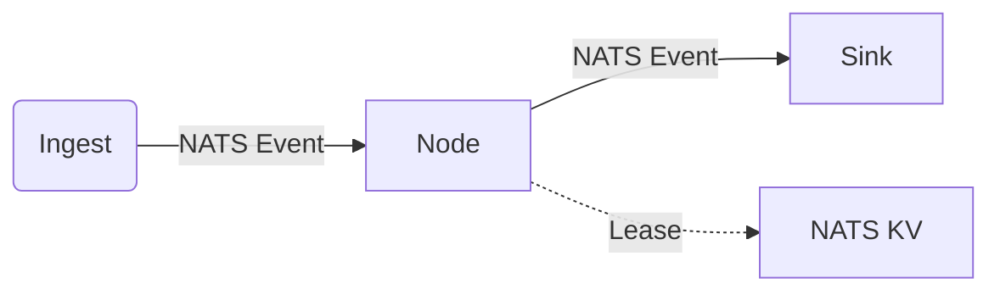
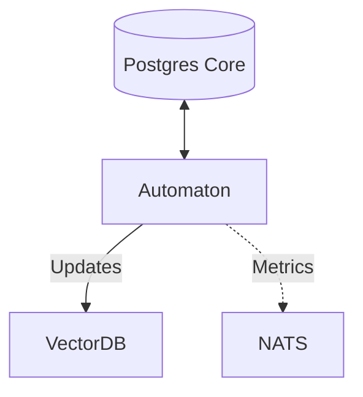

# node Patterns: Nodes vs. Automatons

The Sinex architecture employs two primary patterns for distributed agents ("nodes"). Understanding the distinction is crucial for deployment planning and development.

## 1. Stream Nodes (The "Edge" Model)

Stream Nodes are reactive, event-driven components designed to operate near the data source.

- **Primary Trigger**: Inbound NATS messages (Events).
- **State**: Ephemeral or locally cached (via NATS KV).
- **Database Dependency**: **Optional / None**. Use `SINEX_EDGE_MODE=1` to suppress DATABASE_URL requirement.
- **Coordination**: NATS KV (LeaseManager).
- **Examples**:
  - `sinex-document-ingestor`: Receives file events, extracts text, emits text events.
  - `sinex-code-analyzer`: Listens for code changes, computes complexity metrics.

### Architecture

## 2. Automatons (The "Core" Model)

Automatons are autonomous control loops or heavy aggregators that maintain the system's "Source of Truth".

- **Primary Trigger**: Timer loops, Cron schedules, or Complex Queries.
- **State**: Persistent, Relational, Historical.
- **Database Dependency**: **Hard Requirement**. Requires full access to the canonical PostgreSQL/TimescaleDB.
- **Coordination**: NATS KV for service coordination; may use advisory locks for DB-internal operations (migrations, replay state).
- **Examples**:
  - `sinex-search-automaton`: Queries DB for unindexed content, pushes to Vector DB.
  - `sinex-analytics-automaton`: Aggregates hourly metrics from raw events table.
  - `sinex-health-automaton`: Scans `operations_log` for stalled jobs.

### Architecture

## 3. Deployment Implications

| Feature | Stream Node | Automaton |
|---------|------------------|-----------|
| **Scalability** | Horizontal (Consumer Groups) | Singleton / Partitioned |
| **Location** | Edge / Device / Cloud | Core Cloud / Data Center |
| **Connectivity** | NATS Only (Tolerates Gaps) | Low Latency DB Access |
| **Security** | Minimal Access (Credentials) | Full DB Privileges |

## 4. Hybrid nodes

Some nodes may function as hybrids. For example, a node that *optionally* enriches data from the DB if available, but degrades gracefully if not. However, strict separation is encouraged to maintain clear "Edge" vs "Core" boundaries.
