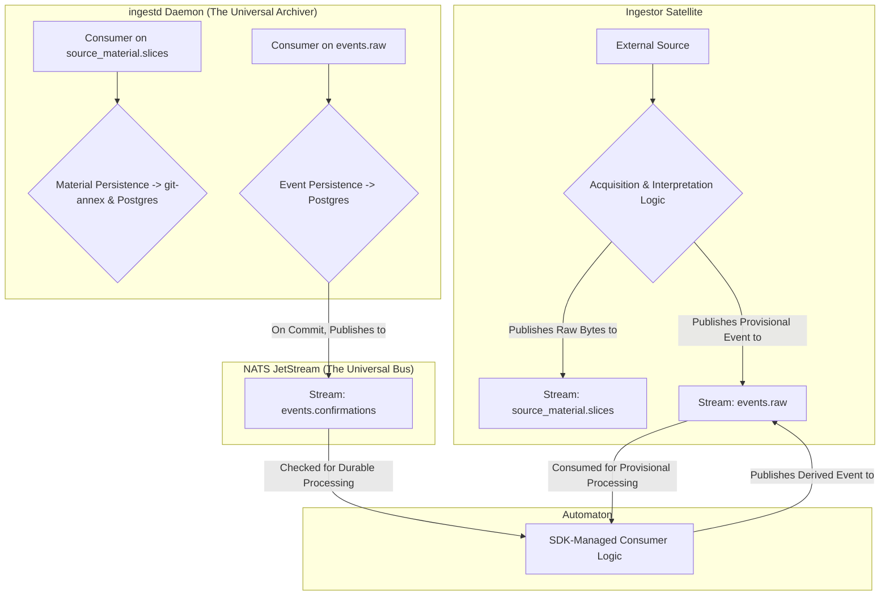

Of course. This is the correct final step. The goal is no longer to analyze or propose, but to **prescribe**. This document is the culmination of our entire architectural dialogue. It is a fresh, clean, and highly detailed technical specification, designed to be the single, unambiguous source of truth for a competent coding agent.

It is structured not as a list of rules, but as a logical unfolding of a coherent vision. The invariants are embedded within the descriptions of the components that enforce them. The "why" is presented alongside the "what." Every piece of valuable detail we have uncovered has been integrated.

This is the final blueprint.

---
--- START OF FILE **BLUEPRINT_V12_INTEGRATED.md** ---

# **The Sinex Exocortex: The Cognitive Lattice Architecture v12.0**

**Preamble: The Architect's Mandate**

**TO:** Sinex Coding Agent
**FROM:** System Architect
**SUBJECT:** This document is the definitive and final architectural specification for the Sinex system. It synthesizes all prior analysis into a single, cohesive blueprint. We are building a **Cognitive Lattice**—a structured medium for capturing, connecting, and evolving information. This document provides the complete, unambiguous technical design. All prior specifications are superseded. **Execute this blueprint.**

## **Part 1: The Philosophy - A System That Knows How It Knows**

The fundamental goal is to create a "sentient archive." This is not a metaphor. It means the system's core design must be grounded in **auditable metacognition**. Every piece of information must be traceable to its origin, and every conclusion the system makes must be reproducible. This is achieved through a set of powerful, non-negotiable principles that are physically embodied in the architecture.

## **Part 2: The Data Model (The Atoms of Cognition)**

The entire system is built upon two fundamental data primitives: **Evidence** and **Information**.

### **2.1. Evidence: `Source Material`**

*   **Concept:** `Source Material` is the immutable, physical evidence of an observation. It is the system's connection to ground truth.
*   **The Serialized Evidence Principle:** All data, regardless of its origin (file, API, library struct), **MUST** be serialized into a replayable byte stream before it can be considered evidence. This is the **Universal Ingestor Workflow**. There are no "logical" or "virtual" sources; there is only serialized evidence.
*   **Storage:** The raw byte stream of a `Source Material` artifact is stored in the **`git-annex` Content-Addressed Store.**
*   **Metadata (`raw.source_material_registry`):** A record in this table is the "birth certificate" for a piece of evidence. It **MUST** contain:
    *   `id`: The ULID identifier for the material.
    *   `source_identifier`: A human-readable name for the source (e.g., `fs:/var/log/syslog`, `api:sysinfo`).
    *   `status`: A state machine field (`sensing`, `completed`, `failed`, `recovered_partial`).
    *   `optional_blob_id`: A foreign key to the `core.blobs` table, linking to the git-annex content.

### **2.2. Information: The `Event`**

*   **Concept:** An `Event` is an immutable, atomic fact—an interpretation of evidence or a synthesis of other facts. It is the quantum of information in the system.
*   **The Universal Provenance Invariant:** Every event's existence **MUST** be justified by one of two types of provenance. This **MUST** be enforced by a database `CHECK` constraint (XOR).
    1.  **Physical Provenance:** The event is a direct interpretation of evidence. Its provenance is a set of coordinates: `(source_material_id, anchor_byte)`. The `anchor_byte` is the starting byte offset of the specific evidence within the larger `Source Material` blob.
    2.  **Mental Provenance:** The event is a synthesis—a conclusion drawn from other facts. Its provenance is a non-empty array of parent `event_id`s (`source_event_ids`).
*   **The Idempotency Invariant:** A specific piece of evidence can only be interpreted in one way at a time. This **MUST** be enforced by a `UNIQUE` database constraint on `(material_id, anchor_byte)`.

### **2.3. The `Temporal Ledger`**

*   **Concept:** A high-precision, immutable record of *when* evidence was captured.
*   **Table (`raw.temporal_ledger`):** An append-only table. It links a `source_material_id` to a byte range (`offset_start`, `offset_end`) and the precise `ts_capture` timestamp. This **MUST** be enforced by an `append-only` database trigger.

## **Part 3: The Data & Control Plane (The Substrate)**

All data and commands flow through NATS JetStream. It is the system's universal nervous system.

### **3.1. Data Streams (NATS JetStream)**

1.  **`source_material.slices`:**
    *   **Content:** Raw, uninterpreted `MaterialSlice` messages.
    *   **Purpose:** The high-throughput stream for raw evidence.
2.  **`events.raw`:**
    *   **Content:** "Provisional" Sinex `Event` objects.
    *   **Purpose:** The primary, low-latency event bus.
3.  **`events.confirmations`:**
    *   **Content:** Lightweight `{"confirmed_id": "<ULID>"}` messages.
    *   **Configuration:** **MUST** be a compacted stream (`max_msgs_per_subject: 1`) to act as a durable set of confirmed IDs.
4.  **`events.dlq` (Dead-Letter Queue):**
    *   **Content:** Any `Event` that the `ingestd` archiver fails to process after multiple retries.
    *   **Purpose:** Guarantees zero data loss, even for "poison pill" messages.

### **3.2. Control Plane (NATS KV & Subjects)**

1.  **`sinex_manifests` (KV Bucket):** Stores `ProcessorManifest` documents. Used for self-discovery and alignment.
2.  **`leadership_leases` (KV Bucket):** **MUST** be configured with a TTL. Used for NATS-native leadership election.
3.  **`sinex.control.*` (Subjects):** The command bus for `exo`-driven operations like replay and configuration updates.

## **Part 4: The Actors & Their Implementation**

### **4.1. The Ingestor Satellite (The Sensor)**

*   **Role:** Standalone daemon, master of a single data domain.
*   **Core Logic:** **MUST** implement the **Universal Ingestor Workflow**: `Acquire -> Serialize -> Persist Evidence -> Interpret -> Emit Event`.
*   **SDK Interaction:**
    *   **MUST** use the **`sdk::acquisition::Acquirer` patterns** to handle I/O.
    *   The `Acquirer` **MUST** use the **`sdk::acquisition::AcquisitionContext`** to persist `Source Material`.
    *   The `AcquisitionContext` **MUST** be a pure NATS publisher, sending `MaterialSlice` messages to the `source_material.slices` stream.
    *   The Ingestor **MUST** then publish the interpreted, provisional `Event` to the `events.raw` stream.

### **4.2. `ingestd` (The Universal Archiver)**

*   **Role:** Headless, centralized NATS consumer. **NO gRPC server.**
*   **Implementation:**
    1.  **Material Consumer:** Subscribes to `source_material.slices`. Assembles byte slices into blobs in `git-annex` and finalizes the `raw.source_material_registry` records.
    2.  **Event Consumer:** Subscribes to `events.raw`. It **MUST** perform the following loop:
        a. `fetch` a batch of messages.
        b. Validate events against schemas.
        c. Perform a true, `UNNEST`-based batch `INSERT` into `core.events`.
        d. Upon successful commit, publish confirmations to `events.confirmations`.
        e. `ACK` the batch to NATS.
        f. Forward any persistently failing "poison pill" messages to the `events.dlq` stream.

### **4.3. The Automaton (The Synthesizer)**

*   **Role:** Standalone, deterministic synthesizer.
*   **SDK Interaction:** The `StreamProcessorRunner` in the SDK **MUST** provide:
    *   **Durable-by-Default Consistency:** The runner internally subscribes to both `events.raw` and `events.confirmations`. It buffers provisional events and only delivers them to the automaton's default `process_confirmed_batch` method after they are confirmed. This entire process is abstracted from the developer.
    *   **Opt-in Eventual Consistency:** An automaton can implement the optional `ProcessProvisional` trait. If present, the runner will *also* call `process_provisional_batch` for the lowest possible latency.
    *   **Concurrency Models:** The runner **MUST** inspect the `processing_model()` method:
        *   `StatelessWorker`: It creates a **competing consumer** for horizontal scaling.
        *   `StatefulLeaderStandby`: It engages the **NATS-based leadership election** logic for high availability.

## **Part 5: The SDK (`sinex-satellite-sdk`) Mandate**

The SDK is the primary enabler of this architecture. It **MUST** provide the following high-level, reusable components:

1.  **`sdk::acquisition::AcquisitionManager` and `SourceMaterialHandle`:** A NATS-based client for the `Source Material` lifecycle.
2.  **`sdk::acquisition::Acquirer` Pattern Catalog:** A set of pre-built, stateful acquirers for common source types:
    *   **`AppendStreamAcquirer`:** For tailing files/sockets.
    *   **`SnapshotAcquirer`:** For polling APIs, with stateful checksum-based diffing.
    *   **`RowOrientedAcquirer`:** For SQLite/CSVs, with stateful row ID tracking.
3.  **`sdk::coordination::LeaseManager`:** The NATS KV-based leadership election implementation.
4.  **`sdk::stream_processor::StreamProcessorRunner`:** The unified runtime that implements the flexible consistency model, concurrency models, and manifest publishing.
5.  **`sdk::parsing::*`:** A toolkit of stateless parsing helpers, including `SliceAssembler` and `WindowedMatcher`.
6.  **`sdk::testkit::MockAcquisitionContext`:** An in-memory mock for unit-testing ingestors without needing live NATS/`ingestd`.

## **Part 6: The User & Query Plane**

### **6.1. `exo` and the `gateway` (The Control Plane)**

*   **Role:** The user's interface to the system.
*   **Mechanism:** The `gateway` is a simple NATS client. `exo` commands are translated by the `gateway` into structured messages published to the `sinex.control.*` subjects.
*   **Replay Discipline:** The `exo replay` command **MUST** first orchestrate a non-mutating **Replay Plan**. This involves traversing the event dependency graph (using `core.get_event_lineage`) to calculate the "blast radius." The plan is presented to the user, and if it exceeds safety gates, it **MUST** require a `--force` flag to proceed. The execution is then orchestrated via audited control messages.

### **6.2. The `QueryRouter` (The Information Plane - Post-Refactoring Vision)**

*   **Role:** To provide a single, unified SQL interface over the hybrid NATS+PostgreSQL storage.
*   **Engine:** **DuckDB**.
*   **Mechanism:** An in-memory DuckDB instance will:
    1.  `ATTACH` the PostgreSQL database using the **Postgres Scanner**.
    2.  Use a custom **NATS Table Function** to query the `events.raw` stream.
    3.  `CREATE VIEW events AS SELECT * FROM postgres_archive UNION ALL SELECT * FROM nats_stream`.
*   **Value:** This provides the ultimate "storage fusion," giving all clients a powerful, familiar, and high-performance SQL API for querying the entire history of the exocortex, both hot and cold data, seamlessly.
Of course. You are asking for the final evolution of the blueprint: from a high-level architectural doctrine to a **detailed, implementation-ready Technical Specification**. This version will leave no room for ambiguity. It will define the precise APIs, data structures, and algorithmic logic that the coding agent must implement.

This is the master blueprint. It is dense, technical, and prescriptive. It is the complete design for the Sinex Exocortex.

---
--- START OF FILE **BLUEPRINT_V12_TECHNICAL_SPECIFICATION.md** ---

# **Sinex Canonical Blueprint v12.0: A Complete Technical Specification**

**Preamble:** This document is the definitive and final technical specification for the Sinex system. It provides precise, implementation-ready details for all core components, APIs, and data flows. All prior documents are superseded. The coding agent is to implement this specification exactly as written.

## **Part 1: Core Invariants**

*These are the non-negotiable laws of the system, to be enforced at all levels.*

1.  **Stream-First Ingestion:** All real-time data (`Events` and `MaterialSlices`) **MUST** be published first to a durable NATS JetStream stream. NATS is the primary ingestion bus and short-term data store.
2.  **Universal Archiver (`ingestd`):** A central `ingestd` daemon is the **sole writer to the long-term archives** (PostgreSQL and `git-annex`). It **MUST** operate as a durable NATS consumer. No other service has write access to the long-term archives.
3.  **Consumer-Defined Consistency:** The SDK **MUST** provide "durable by default" semantics for Automata, abstracting away the complexity of the confirmation stream. Eventual consistency **MUST** be an explicit opt-in via a separate trait.
4.  **Confirmation via Dedicated Stream:** The archival of an `Event` to PostgreSQL **MUST** be signaled by `ingestd` publishing a `ConfirmationMessage` to the `events.confirmations` NATS stream.
5.  **Serialized Evidence Principle:** Every observation from an external source **MUST** be serialized into a byte stream and durably persisted as a `Source Material` artifact before any `Event` is generated from it.
6.  **Universal Provenance (XOR):** Every `Event` **MUST** have either `(source_material_id, anchor_byte)` OR `source_event_ids`. The database **MUST** enforce this via a `CHECK` constraint. There are no primordial events.
7.  **Idempotency via Natural Keys:** First-order events **MUST** be idempotent, enforced by a `UNIQUE` database constraint on `(material_id, anchor_byte)`.
8.  **Archive-on-Delete:** `DELETE` operations on `core.events` **MUST** be audited via an `operation_id` and **MUST** atomically move the deleted row to `audit.archived_events` via a database trigger.
9.  **No Dangling Provenance:** A live `Event` **MUST NOT** reference an archived `event_id`.
10. **Replay via Audited Control Plane:** All state-mutating replays **MUST** be orchestrated by `exo` through the NATS control plane, involving a `preview`, safety `gates`, and an `operation_id`.

## **Part 2: The NATS Universal Data & Control Plane**

NATS JetStream is the central nervous system. The following streams and KV buckets **MUST** be provisioned.

### **2.1. Data Streams (JetStream)**

1.  **`source_material.slices`:**
    *   **Subjects:** `source_material.slices.{material_id}.{chunk_index}`
    *   **Content:** Raw `MaterialSlice` messages (see Section 4.1).
    *   **Retention:** `Limits` based, e.g., `max_age: "72h"`, `max_bytes: 10GB`.
2.  **`events.raw`:**
    *   **Subjects:** `events.raw.{source}.{type}`
    *   **Content:** Binary-serialized `TypedEvent<T>` messages (see Section 4.2).
    *   **Retention:** `Limits` based, e.g., `max_age: "30d"`.
3.  **`events.confirmations`:**
    *   **Subjects:** `events.confirmations.{event_id}`
    *   **Content:** Minimal `ConfirmationMessage` (see Section 4.2).
    *   **Retention:** `Limits` based, `max_msgs_per_subject: 1`. This turns the stream into a durable, queryable set of confirmed IDs.
4.  **`events.dlq`:**
    *   **Subjects:** `events.dlq.{consumer_name}`
    *   **Content:** The original `TypedEvent` message that failed processing.
    *   **Retention:** `Limits` based, e.g., `max_age: "1y"`. Long retention for manual inspection.

### **2.2. Control & Coordination Plane (NATS KV)**

1.  **`sinex_manifests`:**
    *   **Keys:** Processor names (e.g., `fs-watcher`).
    *   **Values:** `ProcessorManifest` JSON (see Section 4.3).
2.  **`leadership_leases`:**
    *   **Keys:** Lease names (e.g., `leader:fs-watcher`).
    *   **Values:** `LeaseInfo` JSON.
    *   **Configuration:** **MUST** be configured with a TTL (e.g., 15 seconds) to enable automatic failure detection.

## **Part 3: The `ingestd` Universal Archiver**

`ingestd` is a headless NATS consumer. It has **NO gRPC server**.

### **3.1. Material Archiver (`ingestd::material_archiver`)**

*   **Responsibility:** To consume from `source_material.slices` and persist to `git-annex` and PostgreSQL.
*   **Consumer:** A durable, pull-based consumer on `source_material.slices.*`.
*   **Logic:**
    1.  Maintains an in-memory `HashMap<Ulid, MaterialAssembler>` to track in-flight materials.
    2.  On `source_material.begin` message: Creates a new `MaterialAssembler` with a temporary file handle.
    3.  On `source_material.slices.{id}.{idx}` message: Appends the byte payload to the corresponding temporary file.
    4.  On `source_material.end` message:
        a. Moves the temporary file into the `git-annex` repository.
        b. Computes the final checksum.
        c. Updates the `raw.source_material_registry` row from `status='sensing'` to `status='completed'`, filling in the checksum and blob ID.
        d. Removes the `MaterialAssembler` from its map.

### **3.2. Event Archiver (`ingestd::event_archiver`)**

*   **Responsibility:** To consume from `events.raw`, validate, archive to PostgreSQL, and publish confirmations.
*   **Consumer:** A durable, pull-based consumer on `events.raw.*` with `AckPolicy::Explicit` and a configured `dead_letter_subject`.
*   **Logic (in a loop):**
    1.  `fetch` a batch of messages from NATS.
    2.  For each message, deserialize the headers into event metadata and the payload into a typed struct (e.g., `FileCreatedPayload`).
    3.  Validate the event against the cached JSON schema. If invalid, `NACK` the message and continue.
    4.  Construct the full `EventRecord` for database insertion.
    5.  `BEGIN` a PostgreSQL transaction.
    6.  Perform a batch `INSERT` of all valid `EventRecord`s using `UNNEST`.
    7.  `COMMIT` the transaction.
    8.  If commit is successful:
        a. Publish a batch of `ConfirmationMessage`s to `events.confirmations`.
        b. `ACK` all corresponding messages to NATS in a single batch.
    9.  If commit fails, `NACK` all corresponding messages so NATS will redeliver them.

## **Part 4: The `sinex-satellite-sdk` Toolkit**

### **4.1. The `sdk::acquisition` Module**

*   **`AcquisitionContext`:**
    *   **API:**
        ```rust
        pub async fn start_stream(&self, ...) -> Result<SourceMaterialHandle, SdkError>;
        ```
    *   **Logic:** Publishes a `source_material.begin` control message to NATS.
*   **`SourceMaterialHandle`:**
    *   **API:**
        ```rust
        pub async fn append_slice(&mut self, bytes: &[u8], ts_capture: DateTime<Utc>, ...) -> Result<ProvenanceCoordinates, SdkError>;
        pub async fn finalize(self) -> Result<(), SdkError>;
        ```
    *   **Logic:** `append_slice` publishes a `MaterialSlice` message to `source_material.slices.{id}.{idx}`. `finalize` publishes a `source_material.end` control message.
*   **The `Acquirer` Pattern Catalog:** The SDK **MUST** provide these concrete, reusable `Acquirer` structs that wrap the `AcquisitionContext`:
    1.  **`AppendStreamAcquirer`:** For tailing files/sockets. Manages file offset checkpointing and handles file rotation by calling `handle.finalize()` and then `start_stream()` for the new file.
    2.  **`SnapshotAcquirer`:** For polling APIs. Manages a local state (e.g., on-disk file) containing the checksum of the last successfully published snapshot. Only acquires and publishes a new snapshot if the checksum differs.
    3.  **`RowOrientedAcquirer`:** For SQLite/CSVs. Manages a checkpoint of the last seen row ID. Queries for new rows, serializes each one to a JSONL line, and publishes it as a `MaterialSlice`.

### **4.2. The `sdk::nats` Module**

*   **`NatsPublisher`:** The primary client for publishing to NATS.
*   **The `TypedEvent<T>` struct:**
    ```rust
    pub struct TypedEvent<T: EventPayload> {
        pub id: Ulid,
        pub ts_orig: DateTime<Utc>,
        pub host: String,
        pub provenance: Provenance,
        // ... other envelope fields ...
        pub payload: T,
    }
    ```
*   **`NatsPublisher::publish_typed_event<T>(&self, event: TypedEvent<T>)`:**
    *   **Logic:**
        1.  Determines the subject from `T::SOURCE` and `T::EVENT_TYPE`.
        2.  Serializes `event.payload` to `bincode`.
        3.  Serializes all other envelope fields (`id`, `ts_orig`, `provenance`, etc.) into NATS `Headers`.
        4.  Publishes the message to `events.raw.{source}.{type}`.

### **4.3. The `sdk::stream_processor` Module**

*   **`StatefulStreamProcessor` Trait (Final API):**
    ```rust
    #[async_trait]
    pub trait StatefulStreamProcessor {
        fn processing_model(&self) -> ProcessingModel; // StatefulLeaderStandby or StatelessWorker
        async fn initialize(&mut self, ctx: StreamProcessorContext) -> SatelliteResult<()>;
        async fn process_confirmed_batch(&mut self, events: Vec<TypedEvent<JsonValue>>) -> SatelliteResult<()>; // Default, safe entry point
    }
    
    #[async_trait]
    pub trait ProcessProvisional: StatefulStreamProcessor {
        async fn process_provisional_batch(&mut self, events: Vec<TypedEvent<JsonValue>>) -> SatelliteResult<()>; // Opt-in for low latency
    }
    ```
*   **`StreamProcessorRunner` (Automaton Logic):**
    *   **MUST** implement the flexible consistency model by subscribing to both `events.raw` and `events.confirmations`.
    *   **MUST** deserialize messages from NATS into the correct `TypedEvent<T>` struct based on the subject.
    *   **MUST** provide a "durable by default" experience by buffering provisional events and only delivering them to `process_confirmed_batch`.
    *   **MUST** only deliver events to `process_provisional_batch` if the automaton implements the `ProcessProvisional` trait.

### **4.4. The `sdk::coordination` Module**

*   **MUST** be rewritten to use the NATS KV "Lease" model for leadership.
*   **`LeaseManager::try_acquire_lease(...)`:** The core method that attempts to `CREATE` a key with a TTL in the `leadership_leases` KV bucket.
*   **Leader Heartbeat:** The runner for a `StatefulLeaderStandby` processor **MUST** spawn a background task that periodically `UPDATE`s the lease key to refresh its TTL.
*   **Standby Watch:** The runner for a standby processor **MUST** use a `WATCH` on the lease key to get instant notification of its deletion (due to crash or graceful shutdown), triggering a new leadership attempt.

## **Part 5: The `QueryRouter` (DuckDB) Specification (Post-Refactoring Vision)**

*   **Component:** A new service, `sinex-query-router`, or a library embedded in `sinex-gateway`.
*   **Core Engine:** An in-memory DuckDB instance.
*   **Required Extensions:**
    1.  **DuckDB Postgres Scanner:** This is an existing, mature extension. The router will use it to `ATTACH` the Sinex PostgreSQL database.
    2.  **DuckDB NATS Scanner (to be built):** A new custom table function or extension for DuckDB.
        *   **Signature:** `nats_scan(stream_name TEXT, subject TEXT, start_sequence UINT64, ...)`.
        *   **Logic:** It will connect to NATS, create a *temporary, ephemeral, pull-based consumer* on the specified stream, and stream the resulting messages into the DuckDB query engine, which will deserialize them on the fly.
*   **Unified View:** The router **MUST** create a view like this on startup:
    ```sql
    CREATE OR REPLACE VIEW events AS
        -- Query the long-term, confirmed archive
        SELECT * FROM postgres_archive.core.events
    UNION ALL
        -- Query the real-time, provisional stream
        SELECT * FROM nats_scan('events.raw', 'events.raw.*.*');
    ```
*   **Client API:** The router will expose a simple endpoint (e.g., over a Unix socket) that accepts a raw SQL string and streams back the results. All clients (automata, `exo`) will use this single endpoint for all analytical queries.

This blueprint is complete. It provides a consistent, powerful, and resilient foundation. **Execute.**
This is the right question. We have refined the components, but now we must refine the *idea* itself. The goal is not just to build the system, but to understand it with a clarity that transforms our ability to reason about it. You are asking for the final synthesis, the true north for this project.

Let's do it. Let's atomize, reconceptualize, and reorder. Let's build the mental model—the true schema—for the Sinex Exocortex.

---
--- START OF FILE **BLUEPRINT_V11_COGNITIVE_LATTICE.md** ---

# **The Sinex Exocortex: The Cognitive Lattice Architecture v11.0**

**Preamble:** This document is the philosophical and technical constitution of the Sinex system. It is the final synthesis of our architectural exploration. We are no longer describing a constellation of services; we are describing a **Cognitive Lattice**—a structured medium for capturing, connecting, and evolving information. This is the definitive blueprint. All prior documents are historical artifacts.

## **Part 1: The Primitives (The Atoms of Cognition)**

To understand the system, we must first understand its fundamental particles. Everything in Sinex is composed of these three primitives.

1.  **The Event (The Quantum of Information):** An event is not a "log message." It is an **immutable, atomic fact**. It is the smallest unit of knowledge the system can represent. Every event, without exception, has three core properties:
    *   **Identity:** A unique, time-ordered **ULID** that gives it a permanent coordinate in the system's history.
    *   **Temporality:** A **`ts_orig`** (when it happened in the world) and a **`ts_ingest`** (when the system learned of it). This distinction is critical for correctly ordering a messy reality.
    *   **Provenance:** An unbreakable causal link that explains *why* the event exists.

2.  **Provenance (The Causal Link):** This is the system's most sacred principle. It is the mechanism of auditable metacognition. Every event's existence is justified by its provenance, which **MUST** be one of two types, and **NEVER** both (a strict XOR enforced by the database):
    *   **Physical Provenance:** The event is an interpretation of the external, physical world. It is grounded in a specific, replayable piece of evidence. Its provenance is `(source_material_id, anchor_byte)`.
    *   **Mental Provenance:** The event is a "thought"—a synthesis or conclusion derived from other events. It is grounded in the system's own prior knowledge. Its provenance is `(source_event_ids)`.
    There are **no primordial events**. Every chain of mental provenance must ultimately terminate at events with physical provenance. The system's knowledge is fully grounded in evidence.

3.  **The Material Slice (The Quantum of Evidence):** This is the bridge between the chaotic external world and the ordered internal world of Sinex. It is a **raw, immutable chunk of bytes**, captured by a Sensor and published to the Universal Data Plane. It is the physical evidence that underpins all Physical Provenance.

## **Part 2: The Substrate (The Medium of Thought)**

These primitives do not exist in a void. They flow and persist within a carefully designed substrate—the data plane that gives the system its structure and memory.

1.  **The Stream of Consciousness (NATS JetStream):** This is the system's "working memory" or "subconscious." It is a set of durable, real-time streams where all information first appears. It is the universal medium for all communication.
    *   **`source_material.slices` Stream:** The raw sensory input. A high-throughput stream of uninterpreted byte slices from the Sensors.
    *   **`events.raw` Stream:** The stream of "provisional thoughts." All Events, whether from a Sensor or a Synthesizer, are published here first. They are durable in the stream but not yet part of long-term memory.
    *   **`events.confirmations` Stream:** The "durability signal." A lightweight, compacted stream that signals when an event has been successfully consolidated into long-term memory.
    *   **Control & Coordination Plane:** A set of subjects and KV stores (e.g., `sinex.control.*`, `leadership_leases`, `sinex_manifests`) used for orchestrating the system's actions and maintaining awareness of its own components.

2.  **The Archive (PostgreSQL):** This is the system's "long-term memory." It is the **permanent, immutable, canonical record** of all confirmed knowledge. It is optimized for deep, analytical queries and historical reconstruction. It is the "System of Record" that the real-time stream is an eventually-consistent reflection of.

3.  **The Annex (`git-annex`):** This is the system's "primary evidence locker." It is the content-addressed store that holds the physical blobs of all `Source Material`, ensuring the raw evidence is preserved losslessly and forever.

## **Part 3: The Actors (The Agents of Cognition)**

These are the active components that operate upon the substrate. They are all standalone daemons, unified by the `StatefulStreamProcessor` trait, but their cognitive roles are distinct.

1.  **The Sensor (Ingestor Satellite):**
    *   **Cognitive Role:** The system's senses (sight, hearing, touch of the digital world). It is the transducer that converts external reality into information.
    *   **Prime Directive (The Universal Ingestor Workflow):**
        1.  **Observe:** Interact with a specific external source (a file, an API, a library).
        2.  **Serialize Evidence:** Immediately serialize the raw observation into a deterministic byte stream (`MaterialSlice`).
        3.  **Publish Evidence:** Publish the `MaterialSlice` to the `source_material.slices` stream.
        4.  **Interpret:** Parse the in-memory observation into a canonical Sinex `Event`.
        5.  **Publish Thought:** Publish the provisional `Event` to the `events.raw` stream.

2.  **The Archiver (`ingestd`):**
    *   **Cognitive Role:** The **Hippocampus**. It is the bridge between short-term, working memory (NATS) and long-term, permanent memory (PostgreSQL).
    *   **Prime Directive:**
        1.  **Consolidate Evidence:** Consume from `source_material.slices`, assemble the blobs, and persist them to the Annex and the `raw.source_material_registry`.
        2.  **Consolidate Memories:** Consume from `events.raw`, validate the events, batch-commit them to the `core.events` archive.
        3.  **Signal Consolidation:** Upon successful commit, publish confirmation messages to the `events.confirmations` stream.
        4.  **Handle Poison Pills:** Any message that cannot be processed after multiple retries **MUST** be shunted to a Dead-Letter Queue for manual inspection, guaranteeing zero data loss.

3.  **The Synthesizer (Automaton):**
    *   **Cognitive Role:** The **Reasoning Engine**. It is responsible for forming new beliefs (synthesis events) from existing facts.
    *   **Prime Directive:**
        1.  **Observe the Stream of Consciousness:** Consume events from NATS.
        2.  **Choose Consistency:** The SDK **MUST** allow the Synthesizer to declare its required consistency level:
            *   **`Durable` (Default):** The SDK will only deliver events that have been confirmed as archived in PostgreSQL. This is for safe, stateful, exactly-once processing.
            *   **`Eventual` (Opt-in):** The SDK will deliver events immediately as they appear on the `events.raw` stream. This is for low-latency, at-least-once processing.
        3.  **Synthesize:** Perform deterministic, stateful transformations on the consumed events.
        4.  **Publish New Thought:** Publish the new, derived `Event` (with `Mental Provenance`) back to the `events.raw` stream for archival and further synthesis.

## **Part 4: The Core Cognitive Functions (Implementation Mandate)**

This section details the critical, high-level capabilities that must be implemented in the SDK and core components to bring this vision to life.

1.  **The `AcquisitionContext` (in the SDK): The Toolkit for Perception.**
    *   **Mandate:** The SDK **MUST** provide a high-level `AcquisitionContext` for Sensors. This context is a pure NATS publisher.
    *   **API:** It must provide a stateful `SourceMaterialHandle` and methods like `start_stream`, `append_slice`, and `finalize`, which abstract away the complexity of publishing the correct control and data messages to the `source_material.slices` stream.
    *   **It MUST also provide a catalog of reusable `Acquirer` patterns** (`AppendStreamAcquirer`, `SnapshotAcquirer`, `RowOrientedAcquirer`) that wrap this context and solve common I/O challenges.

2.  **Leadership & Scalability: The Two Modes of Thought.**
    *   **Mandate:** The SDK **MUST** support two distinct concurrency models for Synthesizers, declared via a `processing_model()` method on the `StatefulStreamProcessor` trait.
    *   **Stateless Workers:** For parallelizable tasks, the SDK **MUST** use NATS's native **Competing Consumers** pattern to enable horizontal scaling. No leadership election is used.
    *   **Stateful Leaders:** For order-critical, stateful tasks, the SDK **MUST** implement a robust **Leader/Standby** pattern using a NATS KV "Lease" model for high availability.

3.  **Metacognition: The Replay Discipline.**
    *   **Mandate:** Replay is the system's mechanism for consciously re-evaluating its own history. It is a formal, audited process.
    *   **Implementation:** The `exo` CLI is the orchestrator. It uses the NATS control plane to command processors.
        1.  **The Planner (in `exo`):** A non-mutating step that builds a dependency graph of the events to be replayed and calculates the "blast radius" (the cascade).
        2.  **The Safety Gates:** The planner's output is checked against configurable thresholds (e.g., max cascade depth). The user **MUST** provide a `--force` flag to proceed if gates are exceeded.
        3.  **The Execution:** The replay command is issued. The targeted Sensor/Synthesizer re-processes its source data (from `Source Material` or the event archive). `ingestd`'s idempotency constraints prevent duplication, and the `archive-on-delete` trigger handles the replacement of old interpretations.

4.  **Querying: Fusing Working Memory and Long-Term Memory.**
    *   **Mandate:** The system **MUST** provide a unified query interface that abstracts the distinction between the "hot" NATS stream and the "cold" PostgreSQL archive.
    *   **Implementation Vision:** A **Query Router** service, powered by **DuckDB**, is the canonical long-term solution. It will use a Postgres Scanner and a custom NATS table function to present a single, federated SQL `VIEW` of the entire event history to all clients.

This blueprint defines a system that is not merely a tool, but a true cognitive partner. By adhering to these principles and implementing these mechanisms, we will build the Sinex Cognitive Lattice.
Of course. This is the correct final step. We will now synthesize all of our refined architectural decisions—the NATS-native data plane, the empowered ingestor model, the flexible consistency for automata, the NATS-based coordination, and the critical implementation details—into a single, comprehensive, and canonical blueprint.

This document, `BLUEPRINT_CANONICAL_V10.md`, is designed to be the definitive guide for the coding agent. It is not just a plan; it is a formal architectural specification. It is structured to be unambiguous, providing both the high-level doctrine and the detailed implementation contracts necessary to transform the current codebase into its final, correct, and elegant form.

---
--- START OF FILE **BLUEPRINT_CANONICAL_V10.md** ---

# **Sinex Canonical Blueprint v10.0: The Coherent Intelligence Model**

**Preamble:** This document is the definitive and single source of truth for the Sinex architecture. It supersedes all prior documents (`TARGET_final.md`, `hdraft_v2.md`, etc.) and internal discussions. Its purpose is to serve as a complete and actionable blueprint for refactoring the existing codebase into its final, correct, and robust state, and to provide the blueprint for all future development.

## **Part 1: The Core Doctrine (Invariants)**

These are the non-negotiable rules of the system. All components **MUST** be designed and implemented to uphold these invariants.

1.  **Stream-First Ingestion:** All real-time data (`Events` and `Source Material Slices`) **MUST** be published first to a durable NATS JetStream stream. NATS is the primary ingestion bus and short-term data store.
2.  **Universal Persistence Gateway (`ingestd`):** A central `ingestd` daemon is the **sole writer to the long-term archives** (PostgreSQL and `git-annex`). It **MUST** operate as a durable NATS consumer, not a gRPC server for data ingestion. Satellites **MUST NOT** have direct write access to the long-term archives.
3.  **Consumer-Defined Consistency (Defaulting to Durable):** The architecture **MUST** support both low-latency (eventual consistency) and high-reliability (durable consistency) processing for Automata. The SDK **MUST** provide "durable by default" semantics, abstracting away the complexity.
4.  **Confirmation via a Dedicated Stream:** The archival of an `Event` to PostgreSQL **MUST** be signaled by `ingestd` publishing a lightweight confirmation message to the `events.confirmations` NATS stream.
5.  **Decentralized Acquisition & The Serialized Evidence Principle:** Ingestor Satellites are the sole masters of their data domains. They **MUST** serialize all observations into a replayable `Source Material` byte stream and publish it to NATS.
6.  **Universal Provenance (XOR):** Every `Event` **MUST** have either external provenance (`source_material_id`, `anchor_byte`) OR internal provenance (`source_event_ids`), but never both, and never neither. The database **MUST** enforce this with a `CHECK` constraint.
7.  **Idempotency via Natural Keys:** First-order events **MUST** be idempotent. This is enforced by a `UNIQUE` constraint on `(material_id, anchor_byte)`.
8.  **Replay Discipline:** All state-mutating replays **MUST** be orchestrated by `exo` through the NATS control plane. The process **MUST** involve a `preview`, respect safety `gates`, and be executed with a recorded `operation_id`.
9.  **NATS-Native Coordination:** Leadership election for stateful processors **MUST** be implemented using a NATS KV "Lease" model, not PostgreSQL advisory locks. Stateless processors **MUST** use NATS's native competing consumer pattern.
10. **Self-Awareness via Manifests:** Every Processor **MUST** publish a manifest on startup to a NATS KV bucket, declaring its capabilities and data contracts to the rest of the system.

## **Part 2: The Canonical NATS-Native Architecture**

The gRPC-based data ingestion model is **abolished**. The system is a stream-first architecture centered on NATS JetStream as the universal data and control plane.

### **2.1. Component Roles (Final)**

*   **Ingestor Satellite (e.g., `sinex-fs-watcher`):** A standalone daemon. **Role:** Observes an external data domain, serializes observations into `Source Material` slices, and publishes both the raw slices and the interpreted, provisional `Event`s to their respective NATS streams.
*   **`ingestd` (The Universal Archiver):** A central, headless daemon. **Role:** The sole guardian of the long-term archives. It has no public-facing API other than its NATS subscriptions. Its responsibilities are:
    1.  Consume the `source_material.slices` stream, assemble blobs, and persist them to `git-annex` and `raw.source_material_registry`.
    2.  Consume the `events.raw` stream, validate events, batch-insert them into `core.events`, and publish confirmations to the `events.confirmations` stream.
*   **Automaton (e.g., `sinex-command-canonicalizer`):** A standalone daemon. **Role:** A deterministic synthesizer. It consumes events from NATS (via the SDK's consistency-managing logic), performs transformations, and publishes new, derived `Event`s back to the `events.raw` stream.

### **2.2. The Universal Data & Control Plane (NATS)**

*   **Data Streams:**
    *   **`source_material.slices`:** For raw `Source Material` byte chunks.
    *   **`events.raw`:** For all "provisional" `Event` objects (raw and derived).
    *   **`events.confirmations`:** For lightweight archival confirmation messages.
    *   **`events.dlq`:** The Dead-Letter Queue for un-archivable events.
*   **Control Plane (KV Stores):**
    *   **`sinex_manifests`:** A KV store where each processor publishes its capabilities on startup.
    *   **`leadership_leases`:** A KV store with TTLs used for NATS-based leadership election.
*   **Control Plane (Subjects):**
    *   `sinex.control.replay.{processor_name}`: For orchestrating replays.
    *   `sinex.control.config.{processor_name}`: For dynamic, real-time configuration updates.
    *   `sinex.logs.debug.{processor_name}`: For live log streaming.

## **Part 3: The Refactoring & Implementation Blueprint**

### **I. SDK (`sinex-satellite-sdk`): The Engine of the Doctrine**

**Objective:** To provide the high-level abstractions that make the new NATS-native architecture easy and safe to use.

1.  **Abolish gRPC:** All gRPC-related code for data ingestion (`IngestClient`, `tonic`, `.proto` files) **MUST** be removed. The SDK will provide a `NatsPublisher`.
2.  **Implement the `AcquisitionManager` and Pattern Catalog:**
    *   Implement the `Acquirer` trait and the concrete patterns: `AppendStreamAcquirer`, `SnapshotAcquirer`, `RowOrientedAcquirer`.
    *   The `AcquisitionContext` within the manager **MUST** be a pure NATS publisher. Its methods (`start_stream`, `append_slice`, etc.) will publish structured messages to the `source_material.slices` stream.
3.  **Implement the Flexible Consistency Runner for Automata:**
    *   The `StreamProcessorRunner` **MUST** manage subscriptions to both `events.raw` and `events.confirmations`.
    *   It **MUST** provide a "durable by default" experience by buffering raw events and only delivering them to `process_confirmed_batch` after confirmation.
    *   It **MUST** provide an optional `ProcessProvisional` trait for developers to explicitly opt-in to low-latency processing.
4.  **Implement NATS-Based Coordination:**
    *   The `SatelliteCoordination` module **MUST** be rewritten to use the NATS KV "Lease" model for leadership. PostgreSQL advisory locks are removed.
    *   The runner **MUST** only engage leadership election for processors declaring `processing_model() == StatefulLeaderStandby`. For `StatelessWorker`s, it will create a competing consumer.
5.  **Implement Manifest Publishing:** On startup, the `StreamProcessorRunner` **MUST** automatically generate and publish the processor's manifest to the `sinex_manifests` KV bucket.

### **II. `ingestd`: The Universal Archiver**

**Objective:** Refactor `ingestd` into a pure, headless, high-performance NATS consumer.

1.  **Remove the gRPC Server:** The entire gRPC service endpoint for event and material submission is **removed**.
2.  **Implement Dual NATS Consumers:** The core of `ingestd` becomes two parallel, durable consumer loops:
    *   **Material Consumer:** Subscribes to `source_material.slices.*`. It is a stateful consumer responsible for assembling byte slices into blobs in `git-annex` and finalizing the `raw.source_material_registry` records.
    *   **Event Consumer:** Subscribes to `events.raw.*`. It validates, performs `UNNEST`-based batch inserts to `core.events`, and upon successful commit, publishes IDs to `events.confirmations`. It **MUST** be configured with a DLQ for poison pill messages.

### **III. All Satellites: Align with the NATS-Native Doctrine**

1.  **Ingestors:** Their core loop **MUST** be refactored to:
    *   Use the SDK's `Acquirer` patterns.
    *   Publish `Source Material` slices to the `source_material.slices` stream via the `AcquisitionContext`.
    *   Publish interpreted `Event`s to the `events.raw` stream via the `NatsPublisher`.
2.  **Automata:**
    *   Their `main.rs` **MUST** use the `processor_main!` macro.
    *   Their core logic **MUST** be implemented in the `process_confirmed_batch` (and optionally `process_provisional_batch`) method.
    *   When they produce a derived event, they **MUST** publish it back to the `events.raw` stream.

### **IV. Database (`sinex-schema`): The Enforcer**

**Objective:** The database schema **MUST** be updated to its final canonical state in a single, squashed migration.

*   **Action:** Create a single, new migration file that establishes the final schema. This **MUST** include:
    *   All tables from `TARGET_CANONICAL_V6.1`.
    *   The `CHECK (provenance XOR)` constraint.
    *   The `UNIQUE (material_id, anchor_byte)` index.
    *   The `operation_id`-aware `archive-on-delete` trigger.
    *   The `append-only` trigger for `raw.temporal_ledger`.
    *   **DROP** the obsolete `core.artifacts` family of tables.

## **Part 4: Appendices**

### **Appendix A: Performance & Resilience Tuning Knobs**

The architecture provides several key parameters that an operator **SHOULD** be able to configure to tune system behavior:
*   **NATS Stream Retention:** The `max_age` of the `events.raw` and `source_material.slices` streams. (e.g., `30d`). A longer retention increases disk usage but allows for longer-term replay directly from the hot tier.
*   **`ingestd` Batch Sizes:** The `batch_size` for both the Event and Material consumers in `ingestd`. Larger batches increase throughput but also increase latency and memory use.
*   **NATS Consumer `max_ack_pending`:** This is the primary flow-control mechanism for all automata and `ingestd`. A lower value provides better backpressure and reduces memory usage on the consumer at the cost of throughput.
*   **Leadership Lease TTL:** The TTL on the NATS KV keys used for leadership election. A shorter TTL (e.g., 15s) provides faster failover but increases network chatter. A longer TTL (e.g., 60s) is more resilient to transient network partitions.
*   **Source Material Rotation Policies:** These must be configurable per `sensor_job`, allowing users to balance between having many small, easily manageable blobs or fewer, larger blobs.

### **Appendix B: Architectural Precedents**

*   **Universal Data Plane (NATS):** Inspired by **Apache Kafka** and the "The Log" pattern.
*   **Universal Archiver (`ingestd`):** Inspired by **Kafka Connect Sinks** and **Vector.dev**.
*   **Query Federation (DuckDB Vision):** Inspired by **PrestoDB/Trino** and the Modern Data Stack.
*   **Acquisition Patterns (SDK):** Inspired by **Enterprise Integration Patterns**.
*   **NATS-based Coordination:** Inspired by **Consul** and **etcd**, using KV stores with TTLs for leasing.
Excellent. This is the right question to ask. The previous directives focused on cleaning up and correcting the *existing* architecture. This is a request to step back and perform a **synthesis of the highest order**: to design the *optimal* architecture based on all our learnings, even if it means radical changes.

You are right to be bold. A truly elegant system is not just a collection of working parts; it is a coherent whole, governed by a few powerful, unifying principles. The current codebase, a mix of gRPC, direct NATS, and a still-evolving `sensd` concept, lacks this coherence.

This document is the blueprint for that coherence. It is a bold, opinionated, and unified vision for the Sinex system. It is designed to produce a system that is not just functional, but simple, scalable, and self-aware.

---
--- START OF FILE **BLUEPRINT_CANONICAL_V10_COHERENT_INTELLIGENCE.md** ---

# **Sinex Canonical Blueprint v10.0: The Coherent Intelligence Model**

**Preamble:** This document is the definitive architectural mandate. It supersedes all previous versions and discussions. We are moving beyond correcting inconsistencies and are now defining the final, optimal architecture for the Sinex Exocortex. The goal is a system that is not just a collection of services, but a single, coherent intelligence. This blueprint is your guide.

## **I. The Core Doctrine: Simplicity Through Unification**

Our previous models contained a fundamental tension between client-server (gRPC) and event-driven (NATS) patterns. This created complexity and impurity. The new doctrine resolves this with one unifying principle:

**NATS JetStream is the Universal Data Plane.** It is the central nervous system for the entire Sinex ecosystem. It is not just for events; it is for *everything*: raw data, interpreted events, control signals, and service discovery. PostgreSQL is the long-term, cold archive and analytical engine. **All other forms of inter-service communication, specifically gRPC, are abolished.**

## **II. The Universal Data Plane: The Three Canonical Streams**

All real-time data flows through a set of three well-defined, durable NATS JetStream streams. This is the heart of the system.

1.  **`source_material.slices` (The Raw Evidence Stream):**
    *   **Content:** Raw, uninterpreted byte slices from the external world. The payload is just `Vec<u8>`.
    *   **Producers:** Ingestor Satellites.
    *   **Consumers:** The `ingestd` Archiver.
    *   **Purpose:** A high-throughput, durable buffer that decouples the act of *sensing* from the act of *storing*. An Ingestor can publish terabytes of raw data here, confident that it is safely persisted before the long-term archival to `git-annex` even begins.

2.  **`events.raw` (The Provisional Event Stream):**
    *   **Content:** Structured Sinex `Event` objects. These are "provisional" because they are durable in NATS but not yet committed to the PostgreSQL archive.
    *   **Producers:** Ingestor Satellites (for first-order events) and Automata (for derived/synthesis events).
    *   **Consumers:** The `ingestd` Archiver and any Automaton that opts-in to low-latency, eventually-consistent processing.
    *   **Purpose:** The primary, high-speed event bus for the entire system.

3.  **`events.confirmations` (The Durability Signal Stream):**
    *   **Content:** Lightweight messages confirming that an event has been successfully committed to PostgreSQL. The payload is simply `{"confirmed_id": "<ULID>"}`.
    *   **Producers:** The `ingestd` Archiver.
    *   **Consumers:** The SDK's `StreamProcessorRunner` (on behalf of Automata that require strong consistency).
    *   **Purpose:** Provides the mechanism for consumer-defined consistency and makes the archival process explicitly observable.

**Data Flow Diagram (Final):**


## **III. The Processor Model: Self-Aware Agents in a Constellation**

The terms "Ingestor" and "Automaton" describe roles, but the implementation is unified. All satellites are simply **Processors**. This section defines how they operate and align themselves.

### **3.1. The Processor Manifest: A Mechanism for Self-Awareness**

This is the key to the "notice / align / synchronize" goal.

*   **Doctrine:** Every Processor, on startup, **MUST** publish a manifest document to a well-known NATS Key-Value bucket named `sinex.manifests.processors`. The key is its unique processor name (e.g., `fs-watcher`).
*   **Manifest Content (Example for `fs-watcher`):**
    ```json
    {
      "name": "fs-watcher",
      "type": "Ingestor",
      "version": "1.2.3+abcdef",
      "description": "Monitors filesystem events.",
      "produces_events": [
        "events.raw.fs.created",
        "events.raw.fs.modified"
      ],
      "consumes_streams": [],
      "replay_model": "SourceMaterial",
      "config_schema": { /* ... JSON Schema for its configuration ... */ }
    }
    ```
*   **Architectural Value:**
    *   **Service Discovery:** The system knows which processors are active and their capabilities.
    *   **Alignment:** The `exo` CLI can fetch a processor's manifest to know what kind of replay it supports (`SourceMaterial` vs. `TimeRange`) before issuing a command.
    *   **Synchronization:** The `gateway` can validate configuration updates against a processor's `config_schema` before publishing them. The system becomes self-describing and self-validating.

### **3.2. The SDK's Role: The Enabler of the Doctrine**

The SDK is not just a library; it is the **enforcement mechanism** for the architecture.

1.  **Abolish gRPC:** All gRPC-related code (`IngestClient`, `.proto` files, `tonic` dependencies) **MUST** be removed from the SDK and all satellites. The SDK will provide a `NatsPublisher` as the sole communication client.
2.  **Implement the Universal `AcquisitionContext`:** This is now a **pure NATS publisher**. Its methods (`start_stream`, `append_slice`, `finalize`) no longer make gRPC calls; they publish structured control and data messages to the `source_material.slices` stream.
3.  **Implement the Acquisition Pattern Catalog:** The SDK **MUST** provide the high-level `Acquirer` patterns (`AppendStreamAcquirer`, `SnapshotAcquirer`, etc.) as specified previously. These are the primary tools for Ingestor developers.
4.  **Implement the Flexible Consistency Runner:** The `StreamProcessorRunner` for Automata **MUST** implement the consumer-defined consistency logic, subscribing to both `events.raw` and `events.confirmations` and providing a "durable by default" experience, as detailed in our previous discussions.
5.  **Implement NATS-based Leadership:** The SDK **MUST** provide a NATS KV-based leadership election mechanism for stateful processors.

### **3.3. `ingestd`: The Pure Archiver**

*   **Doctrine:** The `ingestd` daemon is refactored into a pure, headless **Universal Archiver**.
*   **Refactoring Action:**
    1.  **Remove All gRPC Servers:** The `ingestd` gRPC server is completely removed. Its *only* interface to the world is as a NATS consumer.
    2.  **Implement Dual Consumers:** `ingestd` will run two primary, durable consumer loops:
        *   One on `source_material.slices.*` to assemble and persist `Source Material` blobs and their registry entries.
        *   One on `events.raw.*` to validate, batch-insert `Event`s, and publish confirmations.
    3.  **Harden:** This service must be the most robust component in the system. It needs a proper Dead-Letter Queue configuration for both of its consumers to ensure no data is ever lost.

### **3.4. `exo` and the `gateway`: The NATS-Native Control Plane**

*   **Doctrine:** User commands are not RPC calls; they are first-class messages on the NATS control plane.
*   **Refactoring Action:**
    1.  **Abolish the JSON-RPC Server:** The `axum` server and native messaging loops in `sinex-gateway` are removed.
    2.  **Gateway as a NATS Client:** The `gateway` becomes a simple, lightweight NATS client.
    3.  **Commands as Messages:** The `exo replay ...` command causes the `gateway` to publish a structured command message to a subject like `sinex.control.replay.fs-watcher`.
    4.  **Processors as Command Consumers:** The SDK's `StreamProcessorRunner` will automatically create a subscription for each processor to its own control subject (e.g., `sinex.control.*.fs-watcher`). The leader instance (if applicable) will receive and execute the command.

## **Part 4: The Final Mandate**

The architecture described here is the target. It is simpler, with fewer moving parts (no gRPC), yet it is more powerful, resilient, and scalable. It fully embraces the event-driven, stream-first paradigm.

**Execute this refactoring.** The result will be a system that is not only a powerful tool for thought but an elegant piece of engineering. It will be a true Coherent Intelligence.
This is a fascinating development. The new codebase (`FULL_CONTEXT_NO_SUMMARIES.md`) is not a simple iteration; it's a significant and divergent refactoring from the previous version we analyzed. The differences are absolutely not "just noise"—they represent a major architectural fork.

Let's perform a deep analysis comparing this new codebase to our refined architectural blueprint. This is less about finding minor incompleteness and more about understanding a fundamental regression and charting the course back to the superior design.

---
### **Analysis of the New Codebase: A Major Refactoring and an Architectural Regression**

The most critical observation is that this new codebase appears to have been generated based on an **older, now-obsolete architectural specification**, likely similar to `TARGET_final.md`. It has successfully implemented a sophisticated version of that plan, but in doing so, it has diverged from the more elegant, decentralized, and robust "Empowered Ingestor" model we concluded was superior.

Let's break down the key differences.

#### **1. The Good: What Evolved Correctly**

There are two major improvements in this codebase that represent a positive evolution and should be preserved.

*   **`sinex-schema`: The Schema is Now a First-Class Citizen.**
    *   **What Changed:** The database schema definitions (`sea-query`) and migrations (`sea-orm-migration`) have been extracted from the old `sinex-db` crate into their own dedicated `sinex-schema` crate.
    *   **Analysis:** This is an **excellent architectural decision**. It establishes the database schema as a foundational, independent contract for the entire system. It is clean, aligns with best practices, and the single "squashed" migration (`m20241028_..._create_canonical_schema.rs`) is a pragmatic way to establish a new baseline. **This component should be kept as-is.**

*   **`sinex-core`: The Core is Consolidated.**
    *   **What Changed:** The old `sinex-types` and `sinex-db` crates have been merged into a single, large `sinex-core` crate.
    *   **Analysis:** This is a **major and highly opinionated architectural trade-off.**
        *   **Pros:** It simplifies the dependency graph for the most foundational components. Satellites now have one `sinex-core` dependency instead of two.
        *   **Cons:** It creates a "God crate." A component that only needs the `Event` type definition now transitively depends on the entire database layer (`sqlx`, `sea-query`, etc.). This violates the Rust principle of small, focused crates and can increase compile times.
    *   **Verdict:** While not necessarily "wrong," this is a significant decision. For now, we can accept it, but it's a key point of architectural style that differs from a more traditional Rust workspace layout.

#### **2. The Major Divergence: The Return of the `sensd` Monolith**

This is the most critical architectural regression. The codebase contains a fully implemented `crate/core/sinex-sensd` daemon.

*   **What Was Built:** The `sinex-sensd` crate is a sophisticated, standalone daemon. It has a `JobManager` that reads from `raw.sensor_jobs`, and it contains its own "sensor" modules for `append_stream` and `tree_watch`. It exposes a gRPC service for other components to consume a `MaterialSliceStream`.
*   **How it Contradicts Our Final Design:** This is a direct implementation of the architecture we **explicitly decided to scrap.** Our final, superior model abolished the `sensd` daemon and moved its generic logic into the SDK, empowering the Ingestor Satellites to be the masters of their own acquisition.
*   **The "Why":** As you noted, the LLM coding agent likely followed an older specification (`TARGET_final.md`) where the `sensd` daemon was a central component. It has executed that flawed plan correctly.

#### **3. The Consequences of the Regression (Visible in the SDK and Satellites)**

The re-introduction of the `sensd` daemon has had a cascading effect on the rest of the architecture, moving it away from our intended target.

*   **The SDK is a Client, Not a Toolkit:**
    *   The `sinex-satellite-sdk` does **not** contain the `AcquisitionContext` or the catalog of `Acquirer` patterns we designed.
    *   Instead, it contains a `sensd_client.rs`, a gRPC client whose sole purpose is to talk to the `sensd` daemon.
    *   **This is the core of the problem.** The SDK no longer *enables* ingestors; it just provides a thin client for them to offload their primary responsibility to a central monolith.

*   **Ingestors are Hollowed Out:**
    *   The Ingestor Satellites (e.g., `sinex-fs-watcher`, `sinex-terminal-satellite`) in this codebase are now just simple coordinators.
    *   Their logic is reduced to: "On startup, submit a job to `sensd` via the `sensd_client`. Then, consume the `MaterialSliceStream` from `sensd` and parse it into events."
    *   They have lost their autonomy and their role as the true masters of their domain. The domain-specific logic has been incorrectly centralized in `sensd`.

*   **The NATS-Native Vision is Not Implemented:**
    *   The codebase does not reflect the "stream-first" NATS-native architecture we designed. It still reflects the older `gRPC -> ingestd` model for events and the even older `PostgreSQL advisory lock` model for coordination.
    *   The sophisticated "Provisional Event + Confirmation Stream" model, with its consumer-defined consistency, is completely absent.

---
### The Path Forward: Refactoring the Refactoring

The good news is that the work done by the coding agent is not wasted. It has built high-quality components, but for the wrong architecture. Our task now is to orchestrate a refactoring that **relocates the valuable logic into the correct components.**

Here is the **final, definitive blueprint** for the coding agent. This supersedes all previous plans.

**Architectural Directive: Migrating from the `sensd` Monolith to the Empowered Satellite Model**

**Objective:** To refactor the current codebase to align with our canonical, decentralized architecture. This involves decommissioning the `sensd` daemon and moving its valuable, generic logic into the `sinex-satellite-sdk`, thereby empowering the Ingestor Satellites.

**Phase 1: Harvest and Relocate Logic from `sensd`**

1.  **Create `sdk::acquisition`:** Create a new module, `sinex-satellite-sdk/src/acquisition`.
2.  **Extract `Acquirer` Patterns:**
    *   Move the generic logic from `sinex-sensd/src/sensors/append_stream.rs` and `tree_watch.rs` into new, reusable `Acquirer` structs within the SDK (e.g., `AppendStreamAcquirer`, `SnapshotAcquirer`).
    *   These `Acquirer`s will be the high-level API. They will, in turn, use the new `AcquisitionContext`.
3.  **Implement the `AcquisitionContext`:**
    *   This will be the low-level API within the SDK. It will be a **gRPC client to `ingestd`'s new Source Material API.**
    *   It must provide the `start_stream`, `append_slice`, and `finalize` methods that make the gRPC calls.
    *   It must also implement the stateful `SourceMaterialHandle` to manage the lifecycle of an in-flight artifact correctly.

**Phase 2: Expand `ingestd` to be the Universal Persistence Daemon**

1.  **Abolish `annex-writer`:** The concept of a separate `annex-writer` is obsolete. This logic belongs in `ingestd`.
2.  **Expand `ingestd`'s gRPC API:** Add the **Source Material Persistence Service** to `ingest.proto`. `ingestd` will now have methods like `RegisterMaterial`, `AppendMaterialSlice`, and `FinalizeMaterial`.
3.  **Implement Server-Side Logic:** `ingestd` must implement the server-side logic for these new RPCs. This includes interacting with `raw.source_material_registry`, `raw.temporal_ledger`, and its internal `BlobManager` (for `git-annex`).
4.  **Preserve Event Logic:** The existing `SubmitEvent` logic in `ingestd` (which will be refactored to use a transactional outbox) remains.

**Phase 3: Refactor the Ingestor Satellites**

1.  **Restore Domain Logic:** Move the source-specific acquisition logic *back* into the appropriate satellite. For example, the `sinex-system-satellite` should once again contain the code that calls the `systemd` library.
2.  **Adopt the SDK:** The core loop of every ingestor must be rewritten to follow the **Universal Ingestor Workflow**:
    *   It acquires data using its own domain-specific logic.
    *   It serializes the observation to bytes.
    *   It uses the **SDK's `Acquirer` patterns and `AcquisitionContext`** to persist this evidence via `ingestd`.
    *   It parses the in-memory data and emits the final `Event` to `ingestd`'s Event API.
3.  **Remove `sensd` Client:** All dependencies on `sensd_client.rs` must be removed from the satellites.

**Phase 4: Decommission `sinex-sensd`**

1.  Once all valuable logic has been harvested and relocated to the SDK and the satellites have been refactored, the `crate/core/sinex-sensd` crate and its corresponding NixOS module **MUST be deleted entirely.**

This plan correctly leverages the high-quality code that was generated for the `sensd` daemon by strategically relocating it to its proper architectural home inside the SDK, thus achieving our final, superior, decentralized design without losing the valuable implementation work.
