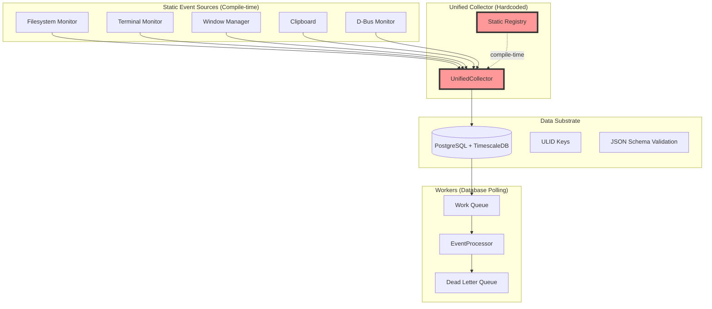

# Sinex Architecture Analysis: Enabling the Missing 80%

## Executive Summary

After deep analysis of the Sinex event capture system, I've identified that while the foundation is solid (~20% implemented), the architecture has significant constraints that prevent achieving the full vision of a "sentient archive." The core issue is the static, compile-time nature of the system that limits extensibility, event correlation, and runtime adaptability.

## Current Architecture Overview



## Key Architectural Components

### 1. EventSource Trait (sinex-core)
**Strengths:**
- Clean abstraction with `initialize()`, `stream_events()`, `shutdown()`
- EventSourceContext provides config + shared resources
- Well-designed for individual source implementation

**Constraints:**
- All sources must be known at compile time
- No runtime registration mechanism
- Registry is manually maintained

### 2. UnifiedCollector (sinex-collector)
**Critical Bottleneck:**
```rust
// Lines 141-191 in collector.rs - EVERY source hardcoded!
if self.needs_source("filesystem") {
    let handle = self.start_filesystem_source(event_tx.clone()).await?;
}
if self.needs_source("terminal.kitty") {
    let handle = self.start_terminal_source(event_tx.clone()).await?;
}
// ... repeated for EVERY source
```

**Issues:**
- Cannot add new sources without modifying collector code
- No plugin/extension mechanism
- Static coupling between collector and all sources

### 3. Data Substrate (PostgreSQL + TimescaleDB)
**Strengths:**
- Immutable event log with ULID keys (time-ordered)
- JSON Schema validation via pg_jsonschema
- Work queue using `SELECT FOR UPDATE SKIP LOCKED`
- Hypertable for efficient time-series storage

**Constraints:**
- All events must go through PostgreSQL
- No real-time streaming pipeline
- Database becomes bottleneck for high-volume capture

### 4. Worker Architecture
**Strengths:**
- EventProcessor trait for processing logic
- Database-polling pattern with retry/backoff
- Dead Letter Queue for failed events

**Constraints:**
- Workers can only react to database events
- No streaming processors for real-time correlation
- Limited to individual event processing

## Architecture vs Vision Gap Analysis

| Capability | Current State | Vision Target | Gap |
|------------|---------------|---------------|-----|
| **Event Sources** | 10 hardcoded sources | 50+ extensible sources | 80% |
| **Runtime Extensibility** | None (compile-time only) | Plugin architecture | 100% |
| **Event Correlation** | Individual processing only | Complex event patterns | 100% |
| **Real-time Processing** | Database polling (1s+) | Streaming (<100ms) | 90% |
| **API Layer** | None | REST/GraphQL/WebSocket | 100% |
| **Knowledge Graph** | Tables exist, unused | Auto-construction | 95% |
| **LLM Integration** | Schema validation only | Semantic analysis | 90% |
| **Query Capabilities** | Basic Python CLI | Advanced DSL | 85% |
| **Agent Ecosystem** | Basic workers | Intelligent agents | 85% |
| **Meta-cognition** | Not captured | First-class events | 100% |

## Core Architectural Constraints

### 1. Static Compilation Requirement
The `create_registry()` function manually lists all events and sources. Adding a new source requires:
1. Implementing the source
2. Adding to registry
3. Modifying UnifiedCollector
4. Recompiling entire system
5. Redeploying

### 2. No Plugin Architecture
- Cannot load sources at runtime
- Cannot add sources without source code access
- Third-party extensions impossible
- User customization severely limited

### 3. Database-Centric Design
- All events must transit through PostgreSQL
- No bypass for high-volume streams
- Correlation requires database queries
- Real-time processing impossible

### 4. Limited Event Processing
- Workers process events individually
- No streaming joins or windows
- No complex event processing (CEP)
- Pattern detection requires custom SQL

### 5. Missing API Layer
- External systems cannot send events
- No webhook support
- No programmatic query interface
- Integration requires database access

## Abstraction Boundary Analysis

### Good Boundaries
- EventSource trait is well-designed
- Clean separation of source/collector/worker
- Database schema is flexible with JSONB

### Problematic Boundaries
- Registry couples all sources to core
- UnifiedCollector knows about every source
- No abstraction for correlation/streaming
- Workers tied to database polling

## Data Flow Bottlenecks

1. **Ingestion**: All events serialize through channels to database
2. **Routing**: Database triggers for event routing (not scalable)
3. **Processing**: Sequential database polling by workers
4. **Correlation**: Requires complex SQL joins across events
5. **Query**: Python CLI directly queries database

## Recommendations for Enabling the Missing 80%

### 1. Plugin Architecture (Critical)
Implement runtime-loadable event sources via:
- External process plugins (recommended)
- WebAssembly sandboxed plugins
- Dynamic library loading

### 2. Event Correlation Engine
Add streaming correlation parallel to storage:
- Time windows for pattern matching
- Complex event processing (CEP)
- Real-time alerts and actions

### 3. API Layer
REST/GraphQL API for:
- External event ingestion
- Programmatic queries
- Source management
- Correlation rules

### 4. Streaming Pipeline
Parallel processing path:
- Direct event stream bypass
- Real-time processors
- WebSocket output

### 5. Dynamic Registry
Hot-reloadable configuration:
- Runtime source registration
- Config file watching
- Zero-downtime updates

## Implementation Roadmap

### Phase 1: Foundation (1-2 months)
- Dynamic registry design
- Basic API layer
- Plugin specification

### Phase 2: Correlation (2-3 months)
- Correlation engine
- Streaming pipeline
- Real-time output

### Phase 3: Plugins (2-3 months)
- Plugin system implementation
- SDK and examples
- Source migration

### Phase 4: Intelligence (3-4 months)
- Advanced correlation patterns
- LLM integration
- Knowledge graph activation

## Conclusion

The Sinex architecture has solid foundations but requires fundamental enhancements to achieve its vision. The static, database-centric design must evolve to support runtime extensibility, real-time processing, and intelligent correlation. These changes would unlock the missing 80% functionality while preserving the system's strengths.