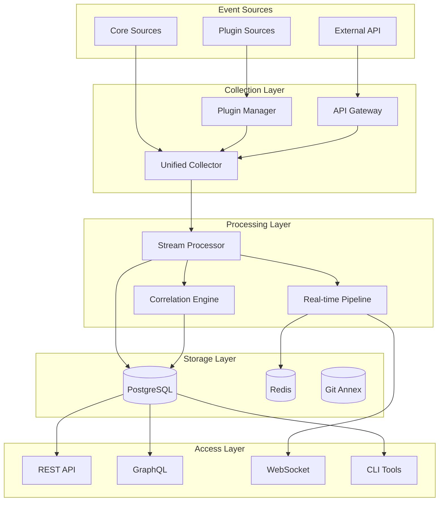

# Sinex Architecture Recommendations: Executive Summary

## Current State Assessment

### What's Working Well (The Good 20%)
- **Solid Foundation**: Clean EventSource trait abstraction
- **Data Integrity**: Immutable event log with ULID time-ordering
- **Scalable Storage**: PostgreSQL + TimescaleDB hypertables
- **Worker Pattern**: Robust SELECT FOR UPDATE SKIP LOCKED
- **Schema Validation**: JSON Schema enforcement

### Critical Architectural Gaps (The Missing 80%)
1. **Static Compilation**: All sources hardcoded in UnifiedCollector
2. **No Runtime Extensibility**: Cannot add sources without recompiling
3. **No Event Correlation**: Events processed individually
4. **Database Bottleneck**: All events must transit through PostgreSQL
5. **No API Layer**: External systems cannot integrate
6. **Limited Query Capabilities**: Basic Python CLI only
7. **No Real-time Processing**: Database polling introduces latency

## Recommended Architecture Evolution

### Core Design Principles
1. **Preserve Immutability**: Never compromise on event integrity
2. **Enable Extensibility**: Runtime plugin architecture
3. **Add Intelligence**: Event correlation and pattern detection
4. **Open the Platform**: API layer for ecosystem growth
5. **Maintain Simplicity**: Incremental changes, not rewrites

### Target Architecture

## Implementation Roadmap

### Phase 1: Foundation Enhancement (Months 1-2)
**Goal**: Prepare architecture for extensibility without breaking changes

#### 1.1 Dynamic Registry
- Replace hardcoded `create_registry()` with configuration-driven system
- Implement hot-reload capability for source configuration
- Add source lifecycle management (enable/disable at runtime)

#### 1.2 Event Router Refactoring
- Decouple UnifiedCollector from specific source implementations
- Create SourceManager abstraction
- Implement message bus pattern for loose coupling

#### 1.3 Basic API Layer
- REST API for event ingestion
- Authentication/authorization framework
- Rate limiting and quota management

**Deliverables**:
- Dynamic source configuration
- Basic REST API (POST /events)
- Source management endpoints

### Phase 2: Plugin Architecture (Months 2-4)
**Goal**: Enable runtime extensibility via plugins

#### 2.1 Plugin Framework
- MessagePack IPC protocol implementation
- Plugin supervisor with health monitoring
- Security sandboxing (process isolation, resource limits)

#### 2.2 Plugin SDK
- Rust SDK with examples
- Python SDK for rapid development
- Plugin manifest specification

#### 2.3 Core Source Migration
- Migrate 2-3 sources to plugin architecture
- Validate performance and stability
- Document plugin development process

**Deliverables**:
- Working plugin system
- 3 migrated sources as reference
- Plugin developer documentation

### Phase 3: Event Correlation Engine (Months 3-5)
**Goal**: Enable real-time pattern detection and correlation

#### 3.1 Streaming Pipeline
- Parallel processing path (bypass database for correlation)
- Event windowing system (time, count, session)
- Stream joining capabilities

#### 3.2 Correlation Rule Engine
- Rule definition language (YAML-based)
- Pattern matching engine
- Action execution framework

#### 3.3 Integration
- Correlation UI in web interface
- Rule templates library
- Performance optimization

**Deliverables**:
- Working correlation engine
- 10+ built-in correlation rules
- Rule builder interface

### Phase 4: Advanced Capabilities (Months 5-6)
**Goal**: Complete the platform transformation

#### 4.1 Full API Layer
- GraphQL API with subscriptions
- WebSocket real-time streaming
- Webhook management

#### 4.2 Query Enhancement
- Advanced query DSL
- Semantic search integration
- Query result caching

#### 4.3 Knowledge Graph Activation
- Entity extraction from events
- Relationship inference
- Graph query API

**Deliverables**:
- Complete API suite
- Knowledge graph functionality
- Advanced query capabilities

## Key Design Decisions

### 1. Plugin Architecture Choice
**Recommendation**: External Process Plugins (like Falco)

**Rationale**:
- Language agnostic (any language can create plugins)
- Strong isolation (crashes don't affect core)
- Resource control (cgroups, quotas)
- Security (sandboxing, limited capabilities)

**Trade-offs**:
- Small IPC overhead (~1ms latency)
- Process memory overhead (~10MB per plugin)

### 2. Correlation Engine Design
**Recommendation**: Stream Processing with Rule Engine

**Rationale**:
- Real-time pattern detection (<100ms latency)
- Scalable to millions of events
- User-definable rules without coding
- Preserves immutability (new events for correlations)

**Implementation**:
- Time-wheel algorithm for windowing
- State machines for sequence matching
- Parallel processing for independent rules

### 3. API Protocol Strategy
**Recommendation**: Multi-Protocol Support

**REST**: Simple integrations, webhooks
**GraphQL**: Complex queries, frontend
**WebSocket**: Real-time streaming
**gRPC**: High-performance, streaming

### 4. Storage Architecture
**Recommendation**: Hybrid Approach

**PostgreSQL**: Source of truth, complex queries
**Redis**: Real-time state, caching
**Git Annex**: Large blobs, media files

## Success Metrics

### Technical Metrics
- Plugin addition without restart: ✓
- Event correlation latency: <100ms
- API throughput: >10K events/sec
- Query response time: <1s for 1M events

### Functional Metrics
- Event sources available: 50+ (vs 10 today)
- Correlation rules active: 100+ (vs 0 today)
- External integrations: 20+ (vs 0 today)
- Query complexity: Multi-source joins (vs single table)

### Vision Alignment
- Runtime extensibility: Achieved via plugins
- Event correlation: Real-time pattern detection
- API ecosystem: Full REST/GraphQL/WebSocket
- Knowledge building: Automated entity extraction
- User empowerment: Custom sources and rules

## Risk Mitigation

### Performance Risks
- **Risk**: Plugin overhead impacts performance
- **Mitigation**: Benchmark thoroughly, set resource limits

### Complexity Risks
- **Risk**: System becomes too complex
- **Mitigation**: Incremental rollout, feature flags

### Compatibility Risks
- **Risk**: Breaking changes for existing users
- **Mitigation**: Backward compatibility layer, migration tools

### Security Risks
- **Risk**: Plugins introduce vulnerabilities
- **Mitigation**: Strict sandboxing, capability model

## Conclusion

The proposed architecture evolution addresses all major gaps while preserving Sinex's core strengths. By implementing these changes incrementally over 6 months, Sinex can transform from a static event collector into a dynamic, intelligent platform that fulfills the vision of a "sentient archive."

The key is to maintain the solid foundation while adding layers of capability that enable:
- **Runtime Extensibility** through plugins
- **Real-time Intelligence** through correlation
- **Platform Openness** through APIs
- **User Empowerment** through customization

This evolution positions Sinex as a unique personal data platform that combines the best patterns from enterprise observability tools with a focus on personal cognitive augmentation.