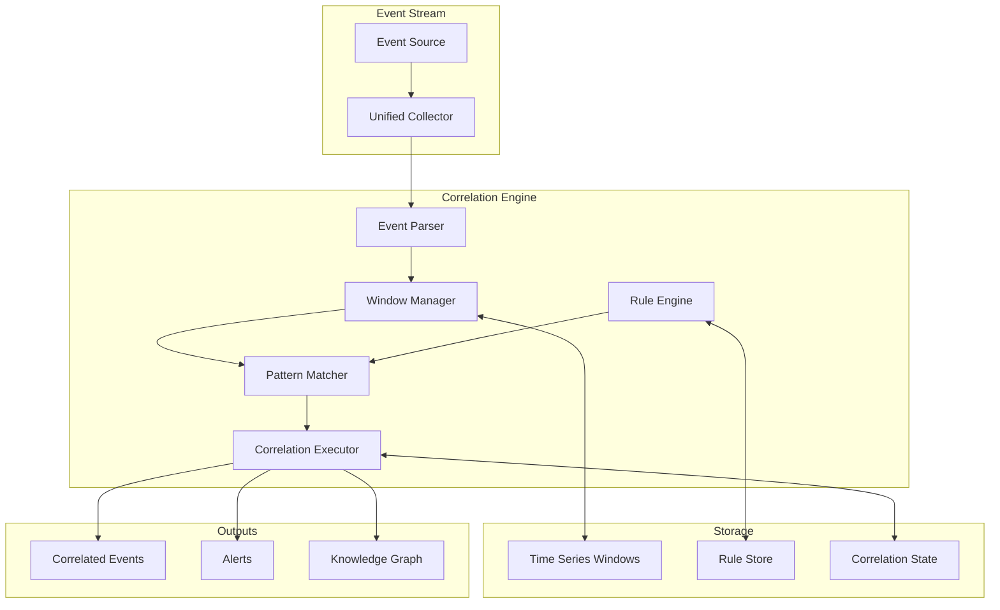

# Event Correlation Engine Design for Sinex

## Overview

The Event Correlation Engine transforms Sinex from a passive event store into an active, pattern-aware system capable of detecting complex behaviors, generating insights, and enabling the "sentient archive" vision.

## Design Goals

1. **Real-time Pattern Detection**: Identify patterns as events occur, not just retrospectively
2. **Flexible Rule Definition**: Support both declarative rules and learned patterns
3. **Scalable Architecture**: Handle millions of events without degrading performance
4. **Preserves Immutability**: Correlations create new events, never modify existing ones
5. **User Empowerment**: Users can define custom correlation rules without coding

## Architecture



## Core Concepts

### 1. Event Windows

```rust
pub enum WindowType {
    /// Fixed time window (e.g., last 5 minutes)
    Time { duration: Duration },
    
    /// Sliding window with specific count
    Count { size: usize },
    
    /// Session-based window (gap between events)
    Session { timeout: Duration },
    
    /// Tumbling window (non-overlapping fixed periods)
    Tumbling { period: Duration },
    
    /// Custom window based on event attributes
    Custom { 
        extractor: Box<dyn Fn(&RawEvent) -> WindowKey>,
    },
}

pub struct EventWindow {
    window_type: WindowType,
    events: Vec<Arc<RawEvent>>,
    start_time: DateTime<Utc>,
    end_time: Option<DateTime<Utc>>,
    metadata: HashMap<String, Value>,
}
```

### 2. Correlation Patterns

```rust
pub enum Pattern {
    /// Sequence of events in order
    Sequence {
        patterns: Vec<EventPattern>,
        max_gap: Option<Duration>,
    },
    
    /// All patterns must match (AND)
    All {
        patterns: Vec<Pattern>,
    },
    
    /// Any pattern must match (OR)
    Any {
        patterns: Vec<Pattern>,
    },
    
    /// Pattern must NOT match
    Not {
        pattern: Box<Pattern>,
    },
    
    /// Aggregate conditions (count, sum, avg)
    Aggregate {
        source_pattern: EventPattern,
        aggregation: AggregateFunction,
        condition: Condition,
    },
    
    /// Complex Event Processing (CEP) pattern
    Complex {
        expression: String, // CEP expression language
    },
}

pub struct EventPattern {
    source: Option<String>,
    event_type: Option<String>,
    payload_conditions: Vec<PayloadCondition>,
    metadata_conditions: Vec<MetadataCondition>,
}
```

### 3. Correlation Rules

```rust
pub struct CorrelationRule {
    pub id: Ulid,
    pub name: String,
    pub description: String,
    pub enabled: bool,
    pub priority: i32,
    
    /// What events trigger this rule
    pub trigger: EventPattern,
    
    /// Window for pattern matching
    pub window: WindowType,
    
    /// Pattern to match within window
    pub pattern: Pattern,
    
    /// Actions when pattern matches
    pub actions: Vec<Action>,
    
    /// Rate limiting
    pub rate_limit: Option<RateLimit>,
    
    /// User-defined metadata
    pub metadata: HashMap<String, Value>,
}

pub enum Action {
    /// Emit a new correlated event
    EmitEvent {
        event_type: String,
        payload_template: String, // Handlebars template
    },
    
    /// Send alert/notification
    Alert {
        severity: AlertSeverity,
        template: String,
        channels: Vec<String>,
    },
    
    /// Update knowledge graph
    UpdateKnowledge {
        entity_updates: Vec<EntityUpdate>,
        relationship_updates: Vec<RelationshipUpdate>,
    },
    
    /// Execute custom function
    Custom {
        function: String,
        params: HashMap<String, Value>,
    },
}
```

## Example Correlation Rules

### 1. Rapid File Modifications
```yaml
name: rapid_file_modifications
description: Detect rapid modifications to the same file
trigger:
  event_type: file.modified
window:
  type: time
  duration: 30s
pattern:
  type: aggregate
  source_pattern:
    event_type: file.modified
    payload_conditions:
      - path: payload.path
        op: equals
        value: $trigger.payload.path
  aggregation: count
  condition:
    op: greater_than
    value: 5
actions:
  - type: emit_event
    event_type: file.rapid_modifications_detected
    payload_template: |
      {
        "path": "{{trigger.payload.path}}",
        "modification_count": {{pattern.result}},
        "time_window": "30s",
        "first_modification": "{{window.start_time}}",
        "last_modification": "{{window.end_time}}"
      }
```

### 2. Command Sequence Detection
```yaml
name: git_commit_workflow
description: Detect typical git commit workflow
trigger:
  event_type: command.executed
  payload_conditions:
    - path: payload.command
      op: starts_with
      value: "git "
window:
  type: session
  timeout: 5m
pattern:
  type: sequence
  max_gap: 1m
  patterns:
    - event_type: command.executed
      payload_conditions:
        - path: payload.command
          op: matches
          value: "^git (status|diff)"
    - event_type: command.executed
      payload_conditions:
        - path: payload.command
          op: starts_with
          value: "git add"
    - event_type: command.executed
      payload_conditions:
        - path: payload.command
          op: starts_with
          value: "git commit"
actions:
  - type: emit_event
    event_type: workflow.git_commit_completed
    payload_template: |
      {
        "duration": "{{window.duration}}",
        "commands": {{window.events | json}},
        "commit_message": "{{pattern.matches[2].payload.command | extract_commit_message}}"
      }
```

### 3. Focus Pattern Detection
```yaml
name: deep_work_session
description: Detect deep work sessions
trigger:
  event_type: window.focused
window:
  type: time
  duration: 30m
pattern:
  type: all
  patterns:
    - type: aggregate
      source_pattern:
        event_type: window.focused
      aggregation: distinct_count
      field: payload.app_id
      condition:
        op: less_than
        value: 3  # Focused on fewer than 3 apps
    - type: not
      pattern:
        type: any
        patterns:
          - event_type: window.focused
            payload_conditions:
              - path: payload.app_id
                op: in
                value: ["discord", "slack", "telegram"]  # Distracting apps
actions:
  - type: emit_event
    event_type: focus.deep_work_session_detected
    payload_template: |
      {
        "start_time": "{{window.start_time}}",
        "duration_minutes": {{window.duration_minutes}},
        "primary_apps": {{pattern.primary_apps | json}},
        "focus_score": {{calculate_focus_score(window.events)}}
      }
```

## Implementation Architecture

### 1. Stream Processing Pipeline

```rust
pub struct CorrelationEngine {
    rules: Arc<RwLock<Vec<CorrelationRule>>>,
    windows: Arc<RwLock<HashMap<WindowKey, EventWindow>>>,
    state: Arc<RwLock<CorrelationState>>,
    output_tx: Sender<CorrelatedEvent>,
}

impl CorrelationEngine {
    pub async fn process_event(&self, event: Arc<RawEvent>) -> Result<()> {
        // 1. Check which rules are triggered by this event
        let triggered_rules = self.find_triggered_rules(&event).await?;
        
        // 2. Update relevant windows
        for rule in &triggered_rules {
            self.update_window(&rule, event.clone()).await?;
        }
        
        // 3. Evaluate patterns in updated windows
        let matches = self.evaluate_patterns(&triggered_rules).await?;
        
        // 4. Execute actions for matched patterns
        for (rule, match_context) in matches {
            self.execute_actions(&rule, &match_context).await?;
        }
        
        // 5. Clean up expired windows
        self.cleanup_windows().await?;
        
        Ok(())
    }
}
```

### 2. Pattern Matching Engine

```rust
pub struct PatternMatcher {
    // Optimized pattern matching using state machines
    sequence_automata: HashMap<RuleId, SequenceAutomaton>,
    aggregate_indices: HashMap<RuleId, AggregateIndex>,
}

impl PatternMatcher {
    pub fn evaluate_pattern(
        &self,
        pattern: &Pattern,
        window: &EventWindow,
    ) -> Result<Option<MatchContext>> {
        match pattern {
            Pattern::Sequence { patterns, max_gap } => {
                self.match_sequence(patterns, window, max_gap)
            }
            Pattern::Aggregate { source_pattern, aggregation, condition } => {
                self.match_aggregate(source_pattern, aggregation, condition, window)
            }
            Pattern::All { patterns } => {
                self.match_all(patterns, window)
            }
            Pattern::Any { patterns } => {
                self.match_any(patterns, window)
            }
            Pattern::Not { pattern } => {
                self.match_not(pattern, window)
            }
            Pattern::Complex { expression } => {
                self.match_complex(expression, window)
            }
        }
    }
}
```

### 3. Rule Definition Language (RDL)

```pest
// Grammar for user-friendly rule definition
rule = { SOI ~ rule_header ~ rule_body ~ EOI }

rule_header = { "rule" ~ identifier ~ "{" }
rule_body = {
    description? ~
    trigger ~
    window ~
    pattern ~
    actions
}

trigger = { "when" ~ event_matcher }
window = { "within" ~ window_spec }
pattern = { "match" ~ pattern_spec }
actions = { "then" ~ action_list }

event_matcher = {
    event_type ~ ("where" ~ conditions)?
}

pattern_spec = {
    sequence_pattern |
    aggregate_pattern |
    complex_pattern
}

sequence_pattern = {
    "sequence" ~ "(" ~ event_matcher ~ ("," ~ event_matcher)* ~ ")"
}

aggregate_pattern = {
    aggregate_function ~ "(" ~ event_matcher ~ ")" ~ comparison
}
```

Example RDL:
```
rule rapid_edits {
    description: "Detect rapid edits to the same file"
    
    when file.modified where path = $initial.path
    within sliding_window(30 seconds)
    match count(file.modified where path = $initial.path) > 5
    then emit rapid_editing_detected {
        path: $initial.path,
        edit_count: $match.count,
        time_span: $window.duration
    }
}
```

## Integration Points

### 1. Real-time Stream Integration

```rust
// Parallel to database storage
pub struct StreamingCollector {
    event_tx: Sender<RawEvent>,
    db_tx: Sender<RawEvent>,
    correlation_tx: Sender<Arc<RawEvent>>,
}

impl StreamingCollector {
    pub async fn handle_event(&self, event: RawEvent) -> Result<()> {
        let arc_event = Arc::new(event.clone());
        
        // Send to database (existing flow)
        self.db_tx.send(event).await?;
        
        // Send to correlation engine (new flow)
        self.correlation_tx.send(arc_event).await?;
        
        Ok(())
    }
}
```

### 2. Storage Integration

```sql
-- Correlation rules table
CREATE TABLE sinex_correlation.rules (
    id ULID PRIMARY KEY,
    name TEXT NOT NULL UNIQUE,
    description TEXT,
    rule_definition JSONB NOT NULL,
    enabled BOOLEAN DEFAULT true,
    priority INTEGER DEFAULT 0,
    created_at TIMESTAMPTZ DEFAULT NOW(),
    updated_at TIMESTAMPTZ DEFAULT NOW()
);

-- Correlation state table
CREATE TABLE sinex_correlation.state (
    rule_id ULID REFERENCES sinex_correlation.rules(id),
    window_key TEXT NOT NULL,
    state_data JSONB NOT NULL,
    expires_at TIMESTAMPTZ NOT NULL,
    PRIMARY KEY (rule_id, window_key)
);

-- Correlated events table
CREATE TABLE sinex_correlation.correlated_events (
    id ULID PRIMARY KEY DEFAULT gen_ulid(),
    correlation_rule_id ULID REFERENCES sinex_correlation.rules(id),
    source_events ULID[] NOT NULL, -- Array of source event IDs
    correlation_type TEXT NOT NULL,
    confidence FLOAT,
    metadata JSONB,
    created_at TIMESTAMPTZ DEFAULT NOW()
);
```

## Performance Optimizations

### 1. Efficient Window Management
- Use circular buffers for fixed-size windows
- Implement time-wheel algorithm for time-based windows
- Lazy evaluation of patterns until window complete

### 2. Pattern Matching Optimization
- Compile patterns to state machines
- Use bloom filters for quick negative matches
- Index events by type and key attributes

### 3. Horizontal Scaling
- Partition rules by event type
- Distribute windows across workers
- Use Redis for shared state

## User Interface

### 1. Rule Builder UI
```typescript
interface RuleBuilder {
  // Visual rule builder
  addTrigger(eventType: string, conditions?: Condition[]): void;
  setWindow(type: WindowType, params: WindowParams): void;
  addPattern(pattern: Pattern): void;
  addAction(action: Action): void;
  
  // Preview and test
  preview(): CorrelationRule;
  testWithSample(events: RawEvent[]): MatchResult[];
}
```

### 2. Monitoring Dashboard
- Active rules and their match rates
- Window memory usage
- Pattern matching performance
- Correlation timeline visualization

## Benefits

1. **Real-time Insights**: Detect patterns as they happen
2. **Complex Behavior Detection**: Multi-event patterns
3. **Proactive Alerts**: Notify on significant patterns
4. **Knowledge Building**: Automatically build relationships
5. **User Empowerment**: Custom rules without coding

## Future Enhancements

1. **Machine Learning Integration**: Learn patterns from historical data
2. **Distributed Correlation**: Scale across multiple nodes
3. **Pattern Library**: Share and reuse correlation patterns
4. **Visual Pattern Designer**: Drag-and-drop rule creation
5. **Anomaly Detection**: Automatic unusual pattern detection