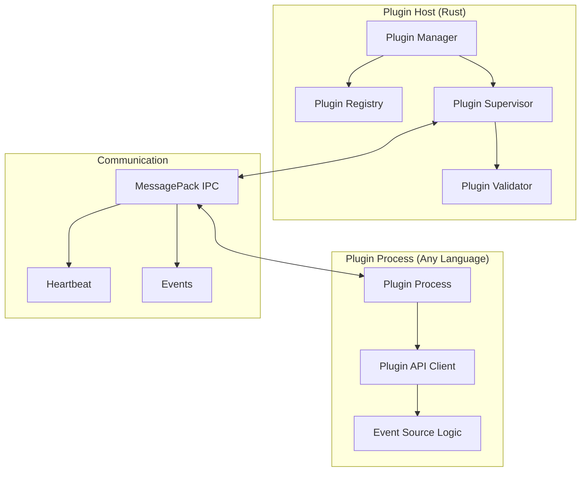
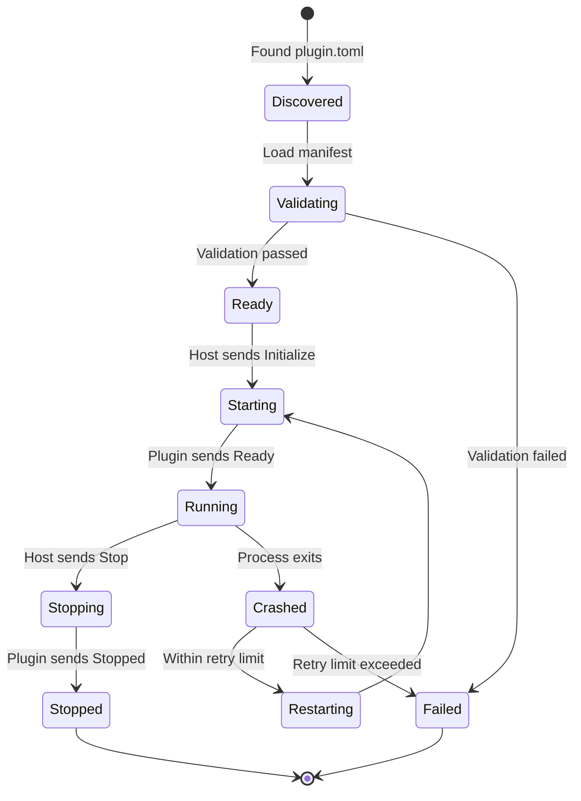

# Plugin Architecture Design for Sinex

## Overview

This document proposes a plugin architecture that enables runtime extensibility for Sinex event sources while maintaining security, performance, and the immutability guarantees of the current system.

## Design Principles

1. **Security First**: Plugins run in isolated processes with limited capabilities
2. **Protocol Simplicity**: Use MessagePack over stdin/stdout for efficiency
3. **Schema Enforcement**: Plugins must declare their event schemas upfront
4. **Hot Reload**: Support adding/removing plugins without restart
5. **Language Agnostic**: Plugins can be written in any language

## Architecture



## Plugin Protocol

### 1. Plugin Manifest (plugin.toml)
```toml
[plugin]
name = "my-custom-source"
version = "1.0.0"
author = "user@example.com"
description = "Custom event source for X"

[plugin.executable]
command = "python3"
args = ["my_plugin.py"]

[plugin.capabilities]
event_types = ["custom.event.created", "custom.event.updated"]
requires_filesystem = true
requires_network = false

[plugin.config_schema]
type = "object"
properties.api_key = { type = "string" }
properties.poll_interval = { type = "integer", default = 60 }
```

### 2. IPC Protocol (MessagePack)

```rust
// Messages from Host to Plugin
#[derive(Serialize, Deserialize)]
enum HostMessage {
    Initialize { 
        config: Value,
        plugin_id: String,
    },
    Start,
    Stop,
    Ping,
    UpdateConfig { config: Value },
}

// Messages from Plugin to Host
#[derive(Serialize, Deserialize)]
enum PluginMessage {
    Ready { 
        capabilities: PluginCapabilities,
        schemas: HashMap<String, JsonSchema>,
    },
    Event(RawEvent),
    Heartbeat { 
        timestamp: DateTime<Utc>,
        stats: PluginStats,
    },
    Error { 
        message: String,
        recoverable: bool,
    },
    Pong,
    Stopped,
}

#[derive(Serialize, Deserialize)]
struct PluginCapabilities {
    event_types: Vec<String>,
    max_events_per_second: Option<u32>,
    supports_backpressure: bool,
    supports_hot_reload: bool,
}

#[derive(Serialize, Deserialize)]
struct PluginStats {
    events_sent: u64,
    errors_count: u64,
    memory_usage_bytes: Option<u64>,
    cpu_usage_percent: Option<f32>,
}
```

### 3. Plugin Lifecycle



## Implementation Details

### Plugin Manager (Rust)

```rust
pub struct PluginManager {
    registry: Arc<RwLock<PluginRegistry>>,
    supervisor: PluginSupervisor,
    config_watcher: ConfigWatcher,
    event_tx: EventSender,
}

impl PluginManager {
    pub async fn discover_plugins(&self, plugin_dir: &Path) -> Result<()> {
        // Scan directory for plugin.toml files
        // Validate manifests
        // Register valid plugins
    }
    
    pub async fn load_plugin(&self, manifest_path: &Path) -> Result<PluginHandle> {
        let manifest = PluginManifest::load(manifest_path)?;
        let validator = PluginValidator::new();
        validator.validate(&manifest)?;
        
        let handle = self.supervisor.spawn_plugin(&manifest).await?;
        self.registry.write().await.register(handle.clone());
        
        Ok(handle)
    }
    
    pub async fn reload_plugin(&self, plugin_id: &str) -> Result<()> {
        // Gracefully stop old instance
        // Start new instance
        // Transfer state if supported
    }
}
```

### Plugin Supervisor (Rust)

```rust
pub struct PluginSupervisor {
    processes: HashMap<String, PluginProcess>,
    restart_policies: HashMap<String, RestartPolicy>,
}

pub struct PluginProcess {
    child: Child,
    stdin: ChildStdin,
    stdout: ChildStdout,
    plugin_id: String,
    stats: PluginStats,
}

impl PluginSupervisor {
    pub async fn spawn_plugin(&self, manifest: &PluginManifest) -> Result<PluginHandle> {
        // Create sandboxed process
        let mut cmd = Command::new(&manifest.executable.command);
        cmd.args(&manifest.executable.args)
            .stdin(Stdio::piped())
            .stdout(Stdio::piped())
            .stderr(Stdio::piped());
        
        // Apply security restrictions
        #[cfg(target_os = "linux")]
        {
            cmd.uid(plugin_uid)
               .gid(plugin_gid)
               .env_clear()
               .env("PLUGIN_ID", &plugin_id);
        }
        
        let child = cmd.spawn()?;
        
        // Set up IPC channels
        let (tx, rx) = mpsc::channel(1000);
        
        // Start message handler
        tokio::spawn(plugin_message_loop(child, tx, rx));
        
        Ok(PluginHandle { plugin_id, tx })
    }
    
    async fn monitor_health(&self) {
        // Periodic health checks
        // Restart crashed plugins
        // Collect metrics
    }
}
```

### Example Plugin (Python)

```python
#!/usr/bin/env python3
import sys
import msgpack
import json
from datetime import datetime
from typing import Dict, Any

class CustomEventSource:
    def __init__(self, config: Dict[str, Any]):
        self.config = config
        self.running = False
        
    async def start(self):
        self.running = True
        while self.running:
            # Your event source logic here
            event = self.capture_event()
            if event:
                yield event
            await asyncio.sleep(self.config.get('poll_interval', 60))
    
    def capture_event(self) -> Optional[Dict[str, Any]]:
        # Implement your event capture logic
        return {
            'source': 'custom.source',
            'event_type': 'custom.event.created',
            'payload': {
                'data': 'example'
            }
        }
    
    def stop(self):
        self.running = False

class PluginHost:
    def __init__(self):
        self.unpacker = msgpack.Unpacker(sys.stdin.buffer, raw=False)
        self.packer = msgpack.Packer()
        self.source = None
        
    def send_message(self, msg: Dict[str, Any]):
        packed = self.packer.pack(msg)
        sys.stdout.buffer.write(packed)
        sys.stdout.buffer.flush()
    
    async def run(self):
        for msg in self.unpacker:
            msg_type = msg.get('type')
            
            if msg_type == 'Initialize':
                config = msg['config']
                self.source = CustomEventSource(config)
                self.send_message({
                    'type': 'Ready',
                    'capabilities': {
                        'event_types': ['custom.event.created'],
                        'supports_backpressure': True,
                    },
                    'schemas': {
                        'custom.event.created': {
                            'type': 'object',
                            'properties': {
                                'data': {'type': 'string'}
                            }
                        }
                    }
                })
                
            elif msg_type == 'Start':
                async for event in self.source.start():
                    self.send_message({
                        'type': 'Event',
                        'event': event
                    })
                    
            elif msg_type == 'Stop':
                if self.source:
                    self.source.stop()
                self.send_message({'type': 'Stopped'})
                break
                
            elif msg_type == 'Ping':
                self.send_message({'type': 'Pong'})

if __name__ == '__main__':
    import asyncio
    host = PluginHost()
    asyncio.run(host.run())
```

## Configuration Integration

### Plugin Discovery Configuration
```toml
[collector.plugins]
enabled = true
plugin_dirs = [
    "~/.config/sinex/plugins",
    "/etc/sinex/plugins",
    "/usr/share/sinex/plugins"
]
auto_reload = true
reload_interval_secs = 60

[collector.plugins.security]
sandbox = true
max_memory_mb = 512
max_cpu_percent = 25
allowed_capabilities = []
```

### Dynamic Source Configuration
```toml
[sources.my_custom_source]
plugin = "my-custom-source"
enabled = true
config.api_key = "secret123"
config.poll_interval = 30
```

## Security Considerations

### 1. Process Isolation
- Run plugins as separate user with minimal privileges
- Use seccomp-bpf to restrict system calls
- Limit filesystem access via mount namespaces
- No network access unless explicitly allowed

### 2. Resource Limits
- Memory limits via cgroups
- CPU quotas to prevent DoS
- Rate limiting on event submission
- Disk usage quotas for plugin data

### 3. Validation
- Schema validation for all events
- Manifest signature verification
- Plugin binary checksum validation
- Runtime behavior monitoring

## Benefits

1. **Runtime Extensibility**: Add sources without recompilation
2. **Language Freedom**: Write plugins in any language
3. **Fault Isolation**: Plugin crashes don't affect core
4. **Hot Reload**: Update plugins without downtime
5. **User Empowerment**: Users can create custom sources
6. **Ecosystem Growth**: Community can contribute plugins

## Migration Path

1. Create plugin SDK with examples
2. Implement plugin host in sinex-collector
3. Migrate 2-3 existing sources to plugins
4. Document plugin development
5. Create plugin marketplace/registry

## Performance Considerations

- MessagePack is ~5x faster than JSON
- Process overhead ~10MB per plugin
- IPC latency <1ms on same machine
- Can handle 10K+ events/second per plugin

## Future Enhancements

1. **Plugin Composition**: Chain plugins together
2. **State Management**: Persistent state for plugins
3. **Plugin UI**: Web interface for management
4. **Cloud Plugins**: Remote plugin execution
5. **Plugin Marketplace**: Share/discover plugins